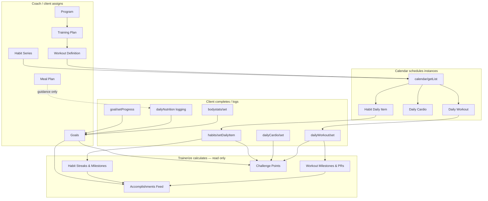
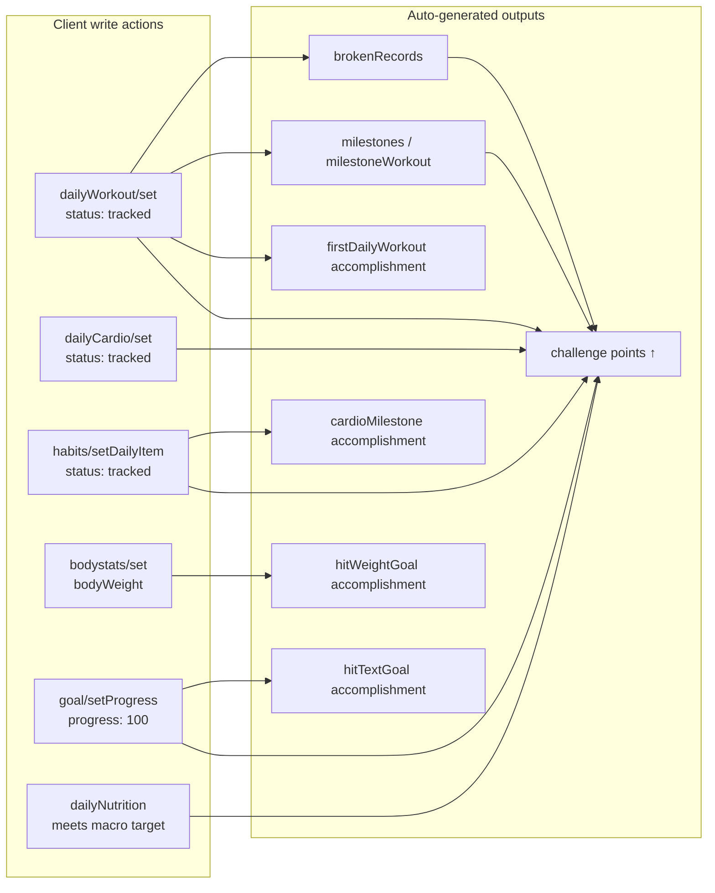

# Mental Model — Feature Relationships

How goals, habits, challenges, milestones, accomplishments, daily workouts, and meal plans fit together in Trainerize.

**Related:** [`README.md`](./README.md) · API refs under [`../api-reference/`](../api-reference/)

---

## The big picture

Trainerize is not one linear pipeline. It is **several parallel tracking systems** that share a **calendar schedule** and feed a **gamification layer** (challenges + accomplishments).



---

## Feature layers

| Layer | Trainerize resource | Has dates? | Client logs data? | Progress stored where? |
|-------|---------------------|------------|-------------------|------------------------|
| Program | `program` | Yes (enrollment) | No | Enrollment dates only |
| Training plan | `trainingPlan` | Yes | No | Plan window |
| Workout template | `workoutDef` | No | No | Blueprint only |
| **Daily workout** | `dailyWorkout` | Yes | **Yes** — sets, reps, status | `dailyWorkout` + exercise `stats[]` |
| **Daily cardio** | `dailyCardio` | Yes | **Yes** — distance, time, HR | `dailyCardio` record |
| **Goal** | `goal` | Varies by type | **Yes** — explicit or derived | Goal record + linked bodystats/nutrition |
| **Habit series** | `habit` (in `habits/getList`) | Yes (start/end) | Via **daily items** | Series stats + per-day items |
| **Habit daily item** | daily item (calendar) | Yes (one day) | **Yes** — `status: tracked` | `habits/setDailyItem` response |
| Meal plan | `mealPlan` | No (template) | No directly | Plan document; compliance via nutrition logs |
| **Daily nutrition** | `dailyNutrition` | Yes | **Yes** — meals/foods | Daily nutrition entry |
| Challenge | `challenge` | Yes (challenge window) | **No** — points are calculated | `challengeParticipant.points` |
| Accomplishment | accomplishment row | Timestamp | **No** — auto-generated | `accomplishment/getList` |
| Milestone (workout) | embedded in workout response | Cumulative | **No** — auto on `dailyWorkout/set` | `milestones[]` in set response + accomplishment feed |
| Milestone (habit) | `milestoneHabit` in habit response | Streak-based | **No** — auto on `habits/setDailyItem` | Habit response + `cardioMilestone` accomplishment |

---

## Two kinds of "milestone"

The word **milestone** appears in multiple places. They are **different systems**:

| Context | Where it appears | Meaning | Example |
|---------|------------------|---------|---------|
| **Workout exercise milestone** | `dailyWorkout/set` → `milestones[]` | Cumulative distance or time threshold crossed for an exercise | Ran 100 km total on treadmill → next target 200 km |
| **Workout count milestone** | `dailyWorkout/set` → `milestoneWorkout` | Nth workout completed (integer > 0) | 50th workout celebration |
| **Habit streak milestone** | `habits/setDailyItem` → `milestoneHabit`, `nextMilestone` | Streak length hit a configured threshold | 7-day water habit streak |
| **Accomplishment: `milestone`** | `accomplishment/getList` | Persisted record of a workout milestone event | Same data, stored for history |
| **Accomplishment: `cardioMilestone`** | `accomplishment/getList` | Persisted habit/cardio streak milestone | Links to `habitStatsID`, `streak` |

**Rule:** Show **immediate feedback** from the write response (`dailyWorkout/set`, `habits/setDailyItem`). Use **accomplishments** for history/trophy case.

---

## Dependency map — what triggers what



### Challenge scoring rules (from `challenge/getList` → `rules`)

Points are **not** set by the app. Each challenge defines weights:

| Rule field | Triggered when |
|------------|----------------|
| `workoutComplete` | Daily workout marked complete (`status: tracked`) |
| `cardioComplete` | Daily cardio marked complete |
| `habitComplete` | Habit daily item tracked |
| `hitPersonalbest` | Personal record broken (`brokenRecords` from workout) |
| `hitDailyNutritionGoal` | Daily nutrition within goal (Trainerize internal check) |
| `hitAGoal` | Any goal achieved (weight/text/nutrition) |
| `appointmentComplete` | Appointment completed |
| `classComplete` | Class completed |
| `clubCheckIn` | Club check-in (string value in API) |

The client's current standing is in `challengeParticipant.points` and `positionInRanking` on `challenge/getList`.

---

## ID chains (cross-feature)

### Workout execution chain

```
program.id
  └── trainingPlan.id                    (planId)
        └── workoutDef.id                (template)
              └── calendar item.itemID   (dailyWorkoutId)
                    └── dailyWorkout.id
                          └── dailyExerciseID  (per exercise, for logging sets)
```

See [`workflow-daily-workouts-and-milestones.md`](./workflow-daily-workouts-and-milestones.md).

### Habit check-in chain

```
habits/getList → habits[].id             (habit series ID — NOT for check-in)
calendar OR habits flow → dailyItemID    (today's check-in target)
  └── habits/setDailyItem { dailyItemID, status: "tracked" }
        └── returns currentStreak, milestoneHabit, nextMilestone
```

**Critical:** `habits[].id` (series) ≠ `dailyItemID` (today's instance). Using the wrong ID returns errors. See [`workflow-habits-and-streaks.md`](./workflow-habits-and-streaks.md).

### Goal progress chain

```
goal/add → goal.id
  ├── textGoal    → goal/setProgress { id, progress }  (manual %)
  ├── weightGoal  → bodystats/set { bodyWeight }       (Trainerize compares to weightGoal)
  └── nutritionGoal → dailyNutrition logging           (compared to caloricGoal / macros)
```

See [`workflow-goals-and-progress.md`](./workflow-goals-and-progress.md).

### Meal plan → nutrition compliance chain

```
mealPlan/get OR mealPlan/generate  →  assigned plan (what to eat)
dailyNutrition/get                 →  what was actually logged + goal object
goal (nutritionGoal)               →  targets for compliance scoring
challenge.rules.hitDailyNutritionGoal → points if day meets target
```

See [`workflow-meal-plans-and-nutrition.md`](./workflow-meal-plans-and-nutrition.md).

---

## Write vs read — integration rules

| Feature | Create | Update / track progress | Read progress | Delete |
|---------|--------|-------------------------|---------------|--------|
| Goals | `POST /me/goals` | `PUT /me/goals`, `PUT /me/goals/progress` | `GET /me/goals/list`, `/detail` | `DELETE /me/goals` |
| Habits | `POST /me/habits` | `PUT /me/habits/daily-items` | `GET /me/habits`, `/daily-items` | `DELETE /me/habits/daily-items` |
| Daily workouts | Prefer update (`id > 0`) | `POST /me/daily-workouts` | `POST /me/daily-workouts/query` | N/A (status change) |
| Meal plan | `POST /me/meal-plan/generate` | `PUT /me/meal-plan` | `GET /me/meal-plan` | `DELETE /me/meal-plan` |
| Bodystats | `POST /me/bodystats` | `PUT /me/bodystats` | `GET /me/bodystats` | `DELETE /me/bodystats` |
| Nutrition | custom food CRUD | MFP/Fitbit sync or TZ logging | `GET /me/nutrition`, `/logs` | food delete |
| Challenges | Coach adds participants (Tier B) | **None** — points automatic | `GET /me/challenges`, leaderboard | Coach removes |
| Accomplishments | **Never** | **Never** | `GET /me/accomplishments`, `/stats` | **Never** |
| Milestones | **Never** | **Never** | Write response + accomplishments | **Never** |

---

## Calendar as the shared hub

There is **no** `dailyWorkout/getList` or habit list-by-date API. The calendar is how you discover **what is scheduled today**:

```
GET /trainerize/me/calendar?startDate=&endDate=
```

Calendar items have a `type` field. Filter by type to branch UI:

| Calendar `type` | Next action |
|-----------------|-------------|
| `workout` | Extract `itemID` → `POST /daily-workouts/query` |
| `cardio` | Extract ID → `GET /daily-cardio` or set |
| habit (if present) | Extract daily item ID → `GET /habits/daily-items` |

Full today-view workflow: [`workflow-client-daily-hub.md`](./workflow-client-daily-hub.md).

---

## Trainer/coach vs client responsibilities

| Action | Who typically does it | API tier |
|--------|----------------------|----------|
| Assign program, training plan, workout schedule | Trainer | Tier B + Trainerize app |
| Assign habits, goals, meal plan (PDF/EN) | Trainer | Tier B or Trainerize app |
| Generate meal plan (planner type) | Client self-service | Tier A `meal-plan/generate` |
| Complete workouts, log habits, log nutrition | Client | Tier A `/me/*` |
| Create challenges, add participants | Trainer / admin | Tier B `challenge/addParticipants` |
| View accomplishments, leaderboard | Client | Tier A read endpoints |

---

## Known gaps and issues

| Issue | Impact | Workaround |
|-------|--------|------------|
| No `dailyWorkout/getList` | Cannot list workout history by date range directly | Calendar → extract IDs → query |
| No `program/getTrainingPlanList` on `/me` | Cannot filter plans by program client-side | Flat `GET /training-plans` or add client route |
| `habits/getDailyItem` Partner API 403 | Habit check-in may be blocked | See [`trainerize-api-issue-2.md`](../api-reference/trainerize-api-issue-2.md) |
| `accomplishment/getStatsList` response undocumented | Stats categories exist but shape unknown | Use `getList` for v1; capture live JSON for stats |
| Meal plan vs nutrition goal overlap | Two sources of calorie/macro targets | Prefer `dailyNutrition/get` → `goal` object for day view; `goal/get` for settings |

---

## Suggested frontend state model

```typescript
// Top-level client fitness state (simplified)
interface ClientFitnessState {
  // Scheduling hub
  calendarEvents: CalendarEvent[]

  // Active assignments (loaded on tab open)
  programs: Program[]
  trainingPlans: TrainingPlan[]
  goals: Goal[]
  habitSeries: HabitSeries[]
  mealPlan: MealPlan | null
  challenges: Challenge[]

  // In-session / today
  activeDailyWorkout: DailyWorkout | null
  activeHabitDailyItem: HabitDailyItem | null
  todayNutrition: DailyNutrition | null

  // Gamification (read-only, refresh after completions)
  accomplishments: Accomplishment[]
  lastCompletionRewards: {
    brokenRecords?: BrokenRecord[]
    milestones?: Milestone[]
    habitStreak?: HabitStreakUpdate
    challengePointsDelta?: number  // re-fetch challenge list to get new total
  }
}
```

**Refresh strategy:** After any completion write (`daily-workouts`, `habits/daily-items`, `bodystats`, nutrition sync), re-fetch accomplishments and challenge list if the UI shows points/trophies.
