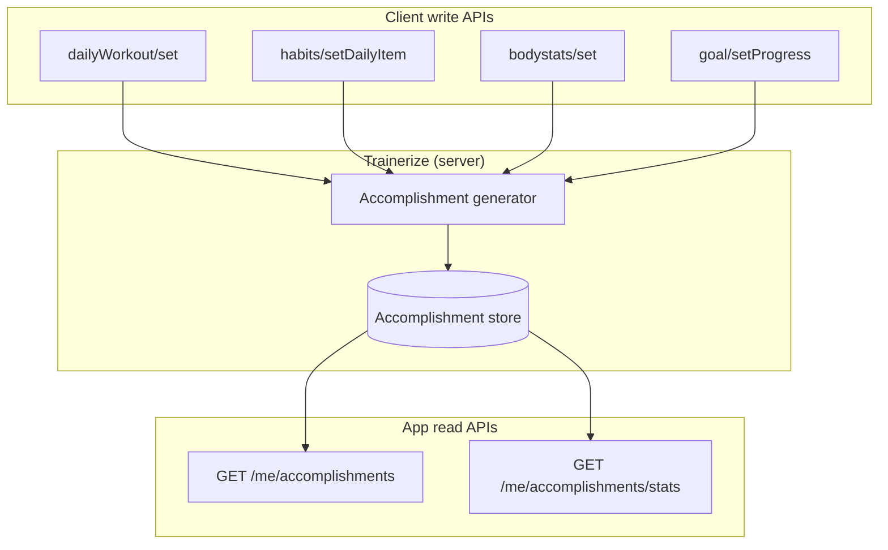
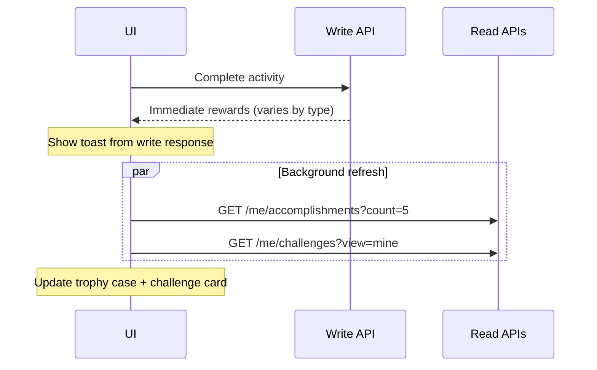

# Workflow — Accomplishments & Rewards Feed

How the **accomplishments** system works — what triggers each type, where immediate vs historical data lives, and how to build a trophy case UI.

**API reference:** [`../api-reference/accomplishment/`](../api-reference/accomplishment/)

---

## Core principle

**Accomplishments are never created by the app.** They are **auto-generated by Trainerize** when qualifying events occur. The portal only **reads** them.

| Write action | Immediate feedback | Historical record |
|--------------|-------------------|-------------------|
| Complete workout | `dailyWorkout/set` → `brokenRecords[]`, `milestones[]` | `accomplishment/getList` |
| Check in habit | `habits/setDailyItem` → streak, `milestoneHabit` | `accomplishment/getList` |
| Hit weight goal | (bodystats triggers server-side) | `hitWeightGoal` accomplishment |
| Hit text goal | (setProgress 100% triggers) | `hitTextGoal` accomplishment |
| First workout ever | (first tracked workout) | `firstDailyWorkout` accomplishment |

**UI pattern:** Toast/modal from **write response** for instant gratification; **accomplishments feed** for profile/history.

---

## Accomplishment types

From `accomplishment/getList` → each entry has a `type` and type-specific detail object:

| Type | Trigger | Detail object | Key fields |
|------|---------|---------------|------------|
| `brokenRecords` | PR broken during workout | `brokenRecords` | `exerciseName`, `brokenRecordType`, `data`, `dataChange`, `unit` |
| `milestone` | Exercise cumulative distance/time threshold | `milestone` | `type` (time/distance), `milestoneValue`, `totalValue` |
| `hitWeightGoal` | Weight goal target reached | `hitWeightGoal` | `currentWeight`, `goalWeight`, `startWeight` |
| `hitTextGoal` | Text goal progress → 100% | `hitTextGoal` | `goalText` |
| `firstDailyWorkout` | First ever workout completed | `firstDailyWorkout` | `dailyWorkoutID`, `name` |
| `cardioMilestone` | Habit streak milestone | `cardioMilestone` | `habitStatsID`, `name`, `streak`, `habitType` |

Common top-level fields:

| Field | Description |
|-------|-------------|
| `accomplishmentID` | Unique ID |
| `userID` | Client |
| `dateTime` | UTC timestamp `YYYY-MM-DD HH:MM:SS` |
| `attachTo` | Related entity ID |

---

## Data flow diagram



---

## Flow 1 — Accomplishment feed (history)

```
GET /api/trainerize/me/accomplishments?start=0&count=20
```

Paginate with `start` and `count`.

**Render by type:**

```typescript
function renderAccomplishment(item: Accomplishment) {
  switch (item.type) {
    case 'brokenRecords':
      return `New PR: ${item.brokenRecords.exerciseName} — ${item.brokenRecords.brokenRecordType}`
    case 'milestone':
      return `Milestone: ${item.milestone.totalValue} ${item.milestone.type}`
    case 'hitWeightGoal':
      return `Weight goal reached: ${item.hitWeightGoal.goalWeight}`
    case 'hitTextGoal':
      return `Goal achieved: ${item.hitTextGoal.goalText}`
    case 'firstDailyWorkout':
      return `First workout: ${item.firstDailyWorkout.name}`
    case 'cardioMilestone':
      return `${item.cardioMilestone.streak}-day streak: ${item.cardioMilestone.name}`
  }
}
```

---

## Flow 2 — Stats by category (aggregate)

```
GET /api/trainerize/me/accomplishments/stats?category=workoutBrokenRecord&start=0&count=10
```

| `category` value | Content |
|------------------|---------|
| `goalHabit` | Goal and habit related stats |
| `workoutBrokenRecord` | Workout PRs |
| `workoutMilestone` | Workout distance/time milestones |
| `cardioBrokenRecord` | Cardio PRs |
| `cardioMilestone` | Cardio/habit streak milestones |

**Note:** Response body is **undocumented** in API refs — capture live JSON before building aggregate UI. Use `getList` for v1.

---

## Mapping triggers to source workflows

### `brokenRecords` ← [`workflow-daily-workouts-and-milestones.md`](./workflow-daily-workouts-and-milestones.md)

1. Client logs workout sets via `POST /me/daily-workouts`
2. Response includes `brokenRecords[]` immediately
3. Same event persisted to accomplishments feed

**Record types** (from API doc):

| Category | `brokenRecordType` examples |
|----------|----------------------------|
| Strength | `oneRepMax`, `maxWeight`, `maxLoad`, … |
| Endurance | `maxReps` |
| Cardio | `maxSpeed`, `maxDistance` |
| Timed | `maxTime`, `minTime`, `maxLoadTimeWeight` |

Also awards **challenge points** (`hitPersonalbest`).

### `milestone` ← workout cumulative

1. Client completes workout with distance/time exercises
2. `dailyWorkout/set` → `milestones[]` with `milestoneValue`, `nextMilestoneValue`
3. Persisted as `milestone` accomplishment

Distinct from `milestoneWorkout` (Nth workout count) — that integer is in the set response; verify if it also creates an accomplishment entry.

### `firstDailyWorkout` ← first completion

Any first `status: "tracked"` daily workout. No special payload required.

### `hitWeightGoal` ← [`workflow-goals-and-progress.md`](./workflow-goals-and-progress.md)

1. Active weight goal exists
2. Client logs weight via `PUT /me/bodystats`
3. When weight meets target, accomplishment created

### `hitTextGoal` ← goals

1. `PUT /me/goals/progress` with `progress: 100`
2. Accomplishment with `goalText`

Also triggers `rules.hitAGoal` challenge points.

### `cardioMilestone` ← [`workflow-habits-and-streaks.md`](./workflow-habits-and-streaks.md)

1. Client checks in habit via `PUT /me/habits/daily-items`
2. Response: `milestoneHabit > 0` when streak threshold hit
3. Persisted as `cardioMilestone` with `streak`, `habitType`

Despite the name, this covers **habit streak milestones**, not only cardio sessions.

---

## Unified completion handler (frontend pattern)

After any tracking write, run a shared rewards handler:



| Write endpoint | Parse from write response | Then refresh |
|----------------|---------------------------|--------------|
| `POST /daily-workouts` | `brokenRecords`, `milestones`, `milestoneWorkout` | accomplishments, challenges |
| `PUT /habits/daily-items` | `currentStreak`, `milestoneHabit` | accomplishments, challenges |
| `PUT /me/bodystats` | body measures only | accomplishments (if weight goal), goals list |
| `PUT /me/goals/progress` | code/message | accomplishments, challenges |

---

## Relationship to challenges

| System | Granularity | Updates |
|--------|-------------|---------|
| **Accomplishments** | Individual events with detail | Append-only feed |
| **Challenges** | Cumulative points in a window | `challengeParticipant.points` |

Same underlying activity may update **both** simultaneously (e.g. PR → `brokenRecords` accomplishment + `hitPersonalbest` points).

---

## Relationship to milestones (terminology)

| Term | System | Mutable? |
|------|--------|----------|
| Workout `milestones[]` | Write response | Calculated per completion |
| `milestoneWorkout` count | Write response | Nth workout |
| Habit `milestoneHabit` | Habit write response | Streak threshold |
| Accomplishment `milestone` | Read feed | Historical snapshot |
| Accomplishment `cardioMilestone` | Read feed | Historical habit streak |

---

## Portal route reference

| Action | Method | Route |
|--------|--------|-------|
| Accomplishment feed | `GET` | `/trainerize/me/accomplishments` |
| Stats by category | `GET` | `/trainerize/me/accomplishments/stats` |

Query: `start`, `count`, `category` (stats only).

---

## Empty states

| State | Meaning |
|-------|---------|
| Empty feed, linked user | No accomplishments yet — normal for new clients |
| 404 on `/me/*` | User not linked to Trainerize |
| Feed not updating after completion | Re-fetch with delay; Trainerize may persist async (test live) |

---

## Test checklist

- [ ] Feed returns paginated accomplishments sorted by `dateTime`
- [ ] Each `type` renders with correct detail object
- [ ] Workout PR appears in feed after `brokenRecords` in set response
- [ ] Habit streak milestone appears as `cardioMilestone`
- [ ] Weight goal achievement appears as `hitWeightGoal`
- [ ] Text goal at 100% appears as `hitTextGoal`
- [ ] First workout appears once as `firstDailyWorkout`
- [ ] Stats endpoint returns data per category (after documenting live shape)
