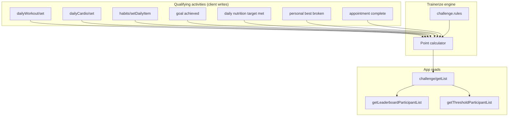
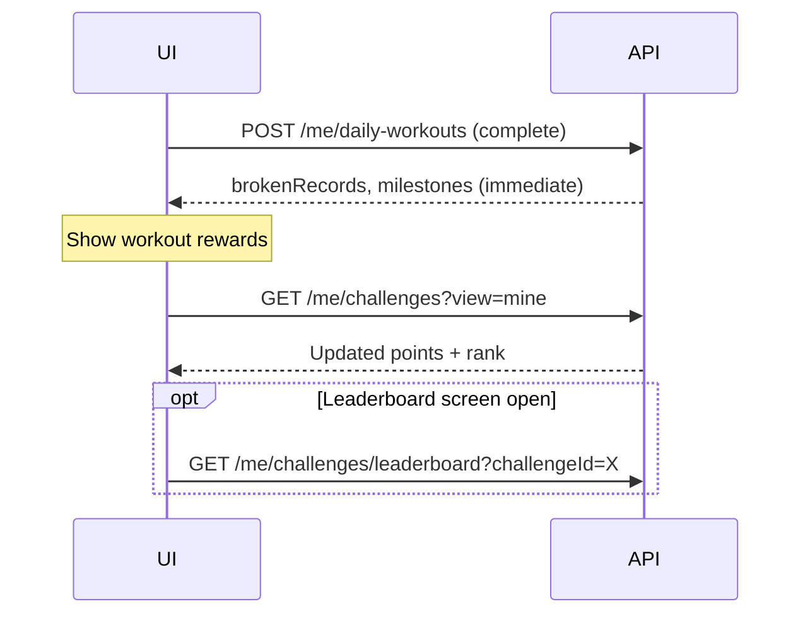

# Workflow — Challenges & Points

How **challenges** work, how **points** are earned from other features, and how to display leaderboard and threshold progress.

**API reference:** [`../api-reference/challenge/`](../api-reference/challenge/)

---

## What is a challenge?

A challenge is a **time-bounded gamification container**. Clients earn **points** for completing activities; rankings are shown on leaderboards or threshold levels.

| Property | Description |
|----------|-------------|
| `challengeID` | Unique ID |
| `challengeName` / `challengeDescription` | Display |
| `challengeType` | Leaderboard vs threshold (and variants) |
| `challengeStatus` | Active, upcoming, ended |
| `startDate` / `endDate` | Window |
| `rules` | Point values per activity type |
| `challengeParticipant` | **Current user's** points, rank, level |

**Key rule:** The app **never writes points**. Points are calculated server-side when qualifying activities complete.

---

## Architecture



---

## Scoring rules (`rules` object)

From `GET /me/challenges` → each challenge includes:

| Rule field | Points when… |
|------------|----------------|
| `workoutComplete` | Daily workout saved with `status: "tracked"` |
| `cardioComplete` | Daily cardio completed |
| `habitComplete` | Habit daily item set to `tracked` |
| `hitPersonalbest` | Personal record broken in workout (`brokenRecords` from `dailyWorkout/set`) |
| `hitDailyNutritionGoal` | Daily nutrition within goal targets |
| `hitAGoal` | Weight, text, or nutrition goal achieved |
| `appointmentComplete` | Appointment marked complete |
| `classComplete` | Class completed |
| `clubCheckIn` | Club check-in recorded |
| `completionThreshold` | Threshold for level-up (threshold challenges) |

**UI tip:** Show rules on challenge detail so clients know what actions earn points.

---

## Flow 1 — Discover active challenges

```
GET /api/trainerize/me/challenges?view=mine
```

| Query | Meaning |
|-------|---------|
| `view=mine` | Challenges the client participates in |
| `view=all` | All visible challenges (may include joinable) |

**Response per challenge:**

```json
{
  "challengeID": 42,
  "challengeName": "Summer Shred 2026",
  "challengeType": "leaderboard",
  "startDate": "2026-06-01",
  "endDate": "2026-08-31",
  "rules": {
    "workoutComplete": 10,
    "habitComplete": 5,
    "hitPersonalbest": 25,
    "hitDailyNutritionGoal": 8,
    "hitAGoal": 50
  },
  "challengeParticipant": {
    "userID": 123456,
    "points": 340,
    "positionInRanking": 4,
    "level": 2,
    "dateJoined": "2026-06-01"
  }
}
```

Display: name, dates, **my points**, **my rank**, rules summary.

---

## Flow 2 — Leaderboard challenge

After client completes activities, **re-fetch** challenge list to get updated `points`.

For full ranking UI:

```
GET /api/trainerize/me/challenges/leaderboard?challengeId=42&start=0&count=20
```

| Param | Purpose |
|-------|---------|
| `challengeId` | Required |
| `searchTerm` | Filter by name |
| `reversed` | Sort direction |
| `start` / `count` | Pagination |
| `preload` | Records to preload around current user |

Response: participants ordered by points, with `positionInRanking`.

**UX pattern:** Initial load centers on current user; scroll up/down to load more (`preload` param).

---

## Flow 3 — Threshold challenge

Threshold challenges group participants by **levels/bases** (tiered milestones based on points).

```
GET /api/trainerize/me/challenges/threshold?challengeId=42&level=level2
```

| Param | Purpose |
|-------|---------|
| `level` | Filter: `level0` … `level4` |
| `searchTerm`, `start`, `count` | Search and pagination |

Use `challengeParticipant.level` from list response to show client's current tier.

`rules.completionThreshold` indicates points needed per level (verify with live data).

---

## Cross-feature point triggers (detailed)

### From daily workouts

```
POST /me/daily-workouts  →  status: "tracked"
```

| Points source | Condition |
|---------------|-----------|
| `workoutComplete` | Always on successful tracked completion |
| `hitPersonalbest` | If response includes non-empty `brokenRecords[]` |
| *(milestone)* | Workout milestones may not add separate points — verify rules |

### From habits

```
PUT /me/habits/daily-items  →  status: "tracked"
```

| Points source | Condition |
|---------------|-----------|
| `habitComplete` | Each successful check-in |

### From goals

| Goal type | Trigger | Rule |
|-----------|---------|------|
| Text | `PUT /me/goals/progress` → 100% | `hitAGoal` |
| Weight | `bodystats/set` meets target | `hitAGoal` |
| Nutrition | Daily target met | `hitDailyNutritionGoal` (daily) + possibly `hitAGoal` |

### From cardio

```
PUT /me/daily-cardio  →  completed
```

| Points source | Condition |
|---------------|-----------|
| `cardioComplete` | Tracked cardio session |

---

## Enrollment — who adds participants?

Clients **read** challenges they are in. Enrollment is typically **coach-driven**:

| API | Tier | Purpose |
|-----|------|---------|
| `challenge/addParticipants` | Tier B (trainer) | Add clients to challenge |
| `challenge/removeParticipants` | Tier B | Remove clients |

No Tier A `/me/challenges/join` route exists today. Self-enrollment may happen in Trainerize app only.

---

## Refresh strategy

Points are **eventually consistent** from the client's perspective:



**Do not** try to calculate points client-side from rules — always re-fetch.

---

## Links to accomplishments

Challenges and accomplishments are **parallel read surfaces**:

| | Challenges | Accomplishments |
|--|------------|-----------------|
| **Unit** | Points | Individual trophy events |
| **Scope** | Per challenge | Lifetime feed |
| **Update** | Re-fetch list | Re-fetch list |
| **Trigger** | Same activities | Same activities |

Show both: points for competition, accomplishments for personal history.

---

## Portal route reference

| Action | Method | Route |
|--------|--------|-------|
| List my challenges | `GET` | `/trainerize/me/challenges` |
| Leaderboard | `GET` | `/trainerize/me/challenges/leaderboard` |
| Threshold levels | `GET` | `/trainerize/me/challenges/threshold` |

Trainer enrollment (Tier B): `challenge/addParticipants`, `removeParticipants` — not on `/me/*`.

---

## Test checklist

- [ ] Challenge list shows participant points and rank
- [ ] Complete workout → re-fetch → points increased by `workoutComplete` value
- [ ] Break PR → additional points from `hitPersonalbest`
- [ ] Habit check-in → points increase by `habitComplete`
- [ ] Leaderboard returns ordered participants
- [ ] Threshold view filters by level
- [ ] Ended challenges still visible with `status` filter if needed
