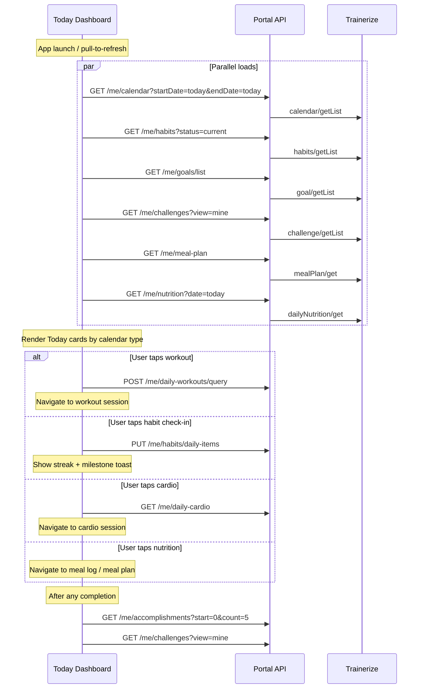

# Workflow — Client Daily Hub (Today View)

Unified flow for the **Today / Dashboard** screen: what the client sees scheduled, and how to act on each item type.

**Related:** [`mental-model-and-relationships.md`](./mental-model-and-relationships.md) · [`workflow-daily-workouts-and-milestones.md`](./workflow-daily-workouts-and-milestones.md) · [`workflow-habits-and-streaks.md`](./workflow-habits-and-streaks.md)

---

## Purpose

The portal has no single "get everything for today" endpoint. The **calendar** is the aggregation point. Goals, habits, challenges, and meal plans are loaded separately and merged in the UI.

---

## End-to-end sequence



---

## Step 1 — Load calendar (schedule)

```
GET /api/trainerize/me/calendar?startDate=2026-06-04&endDate=2026-06-04&unitDistance=km&unitWeight=kg
```

| Param | Source |
|-------|--------|
| `unitDistance`, `unitWeight` | From `GET /me/settings` (cache per session) |

**Use calendar items to build today's task list.** Each item typically has:

| Field | Use |
|-------|-----|
| `date` | Which day |
| `type` | Route to workout / cardio / habit handler |
| `itemID` | Daily instance ID (workout or habit daily item) |
| `detail` | Type-specific metadata (e.g. `workoutID`, name) |
| `status` | Already completed vs pending |

---

## Step 2 — Branch by item type

### Workout item (`type === "workout"`)

1. `itemID` → `dailyWorkoutId`
2. `POST /me/daily-workouts/query` `{ "dailyWorkoutIds": [itemID] }`
3. Open workout session UI
4. On complete → `POST /me/daily-workouts` with `status: "tracked"`

Full detail: [`workflow-daily-workouts-and-milestones.md`](./workflow-daily-workouts-and-milestones.md)

### Cardio item (`type === "cardio"`)

1. Use calendar `itemID` or date to fetch cardio session
2. `GET /me/daily-cardio?date=YYYY-MM-DD` or by exercise ID
3. Log/update via `PUT /me/daily-cardio`

Cardio completion contributes **challenge points** (`rules.cardioComplete`) but does not use workout milestone logic.

### Habit item

Habits appear on the calendar as **daily items** (distinct from habit series in `habits/getList`).

1. Resolve `dailyItemID` from calendar (or from habit detail flow)
2. `GET /me/habits/daily-items?dailyItemId=X` — load today's item
3. Check-in → `PUT /me/habits/daily-items` `{ "dailyItemId": X, "status": "tracked" }`
4. Show streak update from response (`currentStreak`, `milestoneHabit`, `nextMilestone`)

Full detail: [`workflow-habits-and-streaks.md`](./workflow-habits-and-streaks.md)

---

## Step 3 — Parallel context cards (non-calendar)

These are **not** always on the calendar but belong on a dashboard:

| Card | Load | Display |
|------|------|---------|
| **Active goals** | `GET /me/goals/list` | Progress bars; weight from latest bodystats |
| **Habit streaks** | `GET /me/habits?status=current` | Series-level `currentStreak`, `totalCompleted/totalItems` |
| **Meal plan today** | `GET /me/meal-plan` + day index | Today's meals from `mealPlanDays[]` |
| **Nutrition progress** | `GET /me/nutrition?date=today` | Calories/macros vs `goal` object in response |
| **Challenge rank** | `GET /me/challenges?view=mine` | `challengeParticipant.points`, `positionInRanking` |
| **Recent wins** | `GET /me/accomplishments?count=5` | Latest trophies |

---

## Step 4 — Post-completion refresh

After **any** tracking action, refresh gamification state:

| Action completed | Immediate response data | Also refresh |
|------------------|-------------------------|--------------|
| Workout | `milestones[]`, `brokenRecords[]` from `POST /daily-workouts` | accomplishments, challenges |
| Habit | `currentStreak`, `milestoneHabit` from `PUT /habits/daily-items` | accomplishments, challenges |
| Cardio | cardio set response | challenges |
| Bodystats | body measures | goals list (weight goal), accomplishments |
| Text goal progress | goal setProgress response | accomplishments, challenges |
| Nutrition day complete | (Trainerize internal) | challenges, accomplishments |

```
GET /api/trainerize/me/accomplishments?start=0&count=10
GET /api/trainerize/me/challenges?view=mine
```

---

## Weekly compliance (optional dashboard widget)

`user/getClientSummary` (Tier B trainer route) exposes `weeklyStats[]` with:

- `workoutCompleted` / `workoutScheduled` / `workoutCompliance`
- `cardioCompleted` / `cardioScheduled`
- `nutritionCompleted` / `nutritionCompliance`

There is **no Tier A `/me` wrapper** for client summary today. Options:

- Add `GET /trainerize/me/summary` wrapping `getClientSummary` for the linked client
- Derive compliance client-side from calendar + nutrition logs (heavier)

---

## UI layout suggestion

```
┌─────────────────────────────────────────┐
│  Today — June 4, 2026                   │
├─────────────────────────────────────────┤
│  📅 Scheduled (from calendar)           │
│    ☐ Upper Body Strength    [Workout]   │
│    ☐ 30 min Run             [Cardio]    │
│    ☐ Drink 2L water         [Habit]     │
├─────────────────────────────────────────┤
│  🎯 Goals (2 active)                    │
│    Weight: 82/78 kg                     │
│    Text: "Run 5K" — 60%                 │
├─────────────────────────────────────────┤
│  🍽 Nutrition                           │
│    1,840 / 2,200 kcal                   │
│    [View meal plan]                     │
├─────────────────────────────────────────┤
│  🏆 Challenge: Summer Shred — #4 / 128  │
│  ⭐ Latest: Broken PR — Bench Press     │
└─────────────────────────────────────────┘
```

---

## Test checklist

- [ ] Calendar for today returns mixed types (workout, cardio, habit if assigned)
- [ ] Tapping workout resolves `itemID` → query → session → complete
- [ ] Habit check-in uses `dailyItemID`, not habit series `id`
- [ ] Post-workout toast shows PRs/milestones from set response
- [ ] Post-habit toast shows streak from setDailyItem response
- [ ] Accomplishments feed updates after completions
- [ ] Challenge points increase after tracked workout (re-fetch list)
