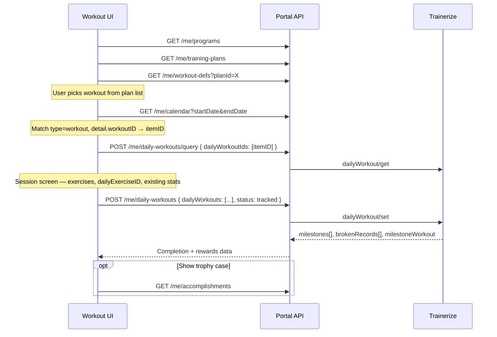
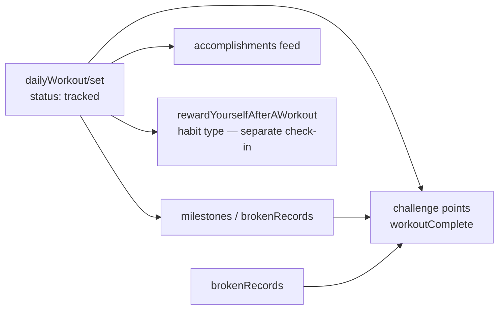

# Workflow — Daily Workouts & Milestones

How scheduled workouts are loaded, completed, and how **workout milestones** and **personal records** are generated.

**Related:** [`../client-workouts-flow.md`](../client-workouts-flow.md) (workouts tab screens) · [`workflow-accomplishments-feed.md`](./workflow-accomplishments-feed.md)

---

## Template vs instance (recap)

| Resource | Role | Portal routes |
|----------|------|---------------|
| `workoutDef` | Blueprint — exercises, targets, no dates | `GET /me/workout-defs?planId=` |
| `dailyWorkout` | Scheduled instance on a date — has `dailyExerciseID`, `stats[]` | `POST /me/daily-workouts/query`, `POST /me/daily-workouts` |

**Rule:** Show structure from workout defs. **Perform and save** via daily workouts.

---

## Full execution flow



---

## Screen-by-screen API map

| Step | Portal route | Trainerize | Purpose |
|------|--------------|------------|---------|
| 1 | `GET /me/programs` | `program/getUserProgramList` | Enrolled programs |
| 2 | `GET /me/training-plans` | `trainingPlan/getList` | Training plans |
| 3 | `GET /me/workout-defs?planId=` | `trainingPlan/getWorkoutDefList` | Workout list + exercises |
| 4 | `GET /me/calendar` | `calendar/getList` | Find `dailyWorkoutId` (`itemID`) |
| 5 | `POST /me/daily-workouts/query` | `dailyWorkout/get` | Hydrate session |
| 6 | `POST /me/daily-workouts` | `dailyWorkout/set` | Save completion |

---

## Progress tracking — what gets stored

### Per-exercise stats

When the client logs sets during a workout, each exercise carries:

```json
{
  "dailyExerciseID": 10282588,
  "def": { "id": 154, "name": "Bench Press" },
  "sets": 3,
  "stats": [
    { "setID": 1, "reps": 10, "weight": 80 },
    { "setID": 2, "reps": 8, "weight": 85 }
  ]
}
```

| Field | Rule |
|-------|------|
| `dailyExerciseID` | **Preserve** from query response. Required for updates. Use `0` only for brand-new exercises added mid-session. |
| `stats[]` | Per-set logged values; shape varies by `recordType` (strength, cardio, timed, etc.) |
| `status` on workout | `scheduled` → `checkedIn` (optional) → `tracked` (completed) |

### Workout-level status

| Status | Meaning |
|--------|---------|
| `scheduled` | Assigned, not started |
| `checkedIn` | Started but not finished |
| `tracked` | Completed — triggers scoring, milestones, challenge points |

---

## Milestones — auto-calculated on completion

When `dailyWorkout/set` succeeds with `status: "tracked"`, the response may include:

### `milestoneWorkout` (integer)

| Value | Meaning |
|-------|---------|
| `0` | Not a count milestone |
| `> 0` | Client hit an Nth-workout milestone (e.g. 10th, 50th workout) |

### `milestones[]` (exercise cumulative)

Per-exercise distance or time thresholds:

| Field | Description |
|-------|-------------|
| `type` | `"time"` or `"distance"` |
| `exerciseID` | Which exercise |
| `milestoneValue` | Threshold just reached |
| `nextMilestoneValue` | Next target |
| `totalValue` | Client's cumulative total |

**Example:** Total treadmill distance crosses 100 km → milestone returned → also appears later in `accomplishment/getList` as type `milestone`.

### `brokenRecords[]` (personal bests)

| Field | Description |
|-------|-------------|
| `exerciseID` | Exercise |
| `recordType` | `strength`, `cardio`, `endurance`, etc. |
| `bestStats` | New bests — `oneRepMax`, `maxWeight`, `maxDistance`, `minTime`, etc. |

Broken records feed:

- Immediate UI celebration
- `accomplishment/getList` type `brokenRecords`
- Challenge points via `rules.hitPersonalbest`

---

## First workout accomplishment

The **first ever** completed daily workout generates:

- Accomplishment type: `firstDailyWorkout`
- Fields: `dailyWorkoutID`, `name`

No special API call — just complete any scheduled workout with `status: "tracked"`.

---

## Links to other features



| Downstream | How it connects |
|------------|-----------------|
| **Challenges** | `rules.workoutComplete` points added automatically |
| **Accomplishments** | `brokenRecords`, `milestone`, `firstDailyWorkout` persisted |
| **Goals** | Indirect — strength/cardio goals may be text goals updated manually; weight goals use bodystats not workouts |
| **Habits** | Workout completion does **not** auto-check habits like `makeItEasierToWorkout` — client must still `habits/setDailyItem` |

---

## Important rules

1. **Prefer updating** scheduled instances (`id > 0` from query). Creating ad-hoc workouts (`id: 0`) is fragile.
2. **Do not send** Trainerize `userId` from the client — portal injects it.
3. **`userID` inside each `dailyWorkouts[]` object** — Trainerize requires this (see api-issues doc).
4. **Comments / RPE** — only on first completion (see `daily-workout-apis.md`).
5. Show **immediate** milestone/PR data from the set response; accomplishments feed is for history.

---

## Known limitations

| Issue | Workaround |
|-------|------------|
| No `dailyWorkout/getList` | Calendar → extract IDs → query |
| Custom exercise logging fails with null error | Use `workoutID` reference to existing workout def |
| No client `workoutDef/get` for full media | List response usually sufficient; add route if needed |

See [`../api-reference/trainerize-api-issues.md`](../api-reference/trainerize-api-issues.md).

---

## Test checklist

- [ ] Calendar resolves correct `itemID` for today's workout
- [ ] Query returns `dailyExerciseID` for each exercise
- [ ] Completion with `status: "tracked"` persists stats on re-query
- [ ] Response includes `brokenRecords` when PR is broken
- [ ] Response includes `milestones` when cumulative threshold crossed
- [ ] `GET /me/accomplishments` shows matching entries after completion
- [ ] Challenge `points` increase on challenge re-fetch
