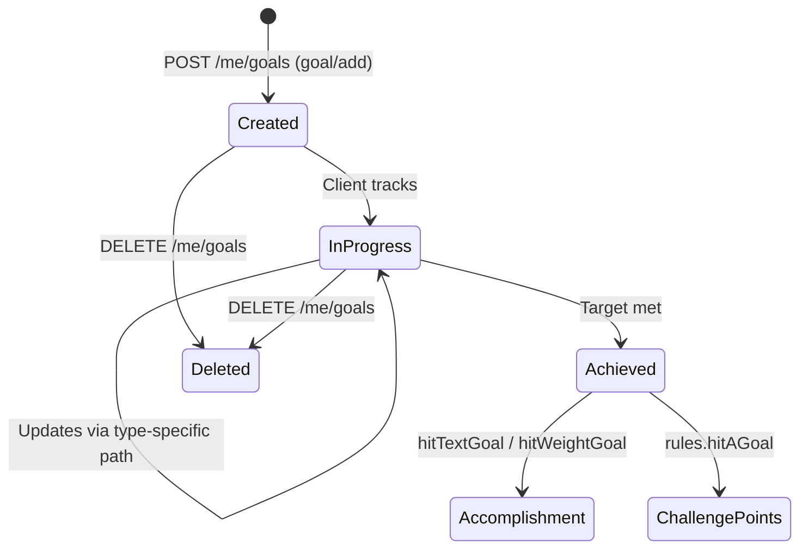

# Workflow — Goals & Progress Tracking

How **text**, **weight**, and **nutrition** goals work, how progress is measured, and what happens when a goal is achieved.

**API reference:** [`../api-reference/goals/`](../api-reference/goals/) · Portal routes under `/trainerize/me/goals/*`

---

## Goal types

| Type | `type` value | Progress mechanism | Achieved when |
|------|--------------|-------------------|---------------|
| Text | `textGoal` | Manual percentage via `goal/setProgress` | `progress` reaches 100% |
| Weight | `weightGoal` | Automatic from `bodystats/set` weight entries | Current weight meets target |
| Nutrition | `nutritionGoal` | Automatic from daily nutrition logging | Daily macros/calories within target |

Only **one active goal per type** is typical (Trainerize enforces at app level; verify with live data).

---

## Lifecycle diagram



---

## Flow 1 — Text goal

### Create

```
POST /api/trainerize/me/goals
{
  "type": "textGoal",
  "text": "Run a 5K under 25 minutes"
}
```

Trainerize returns `{ "id": 12345 }`.

### Track progress (manual)

```
PUT /api/trainerize/me/goals/progress
{
  "id": 12345,
  "progress": 60
}
```

| Field | Description |
|-------|-------------|
| `id` | Goal ID |
| `progress` | Percentage 0–100 |

The client or coach updates progress subjectively (e.g. training weeks completed, subjective readiness).

### Read

```
GET /api/trainerize/me/goals/list?achieved=false
GET /api/trainerize/me/goals/detail?id=12345
```

### On achievement (progress = 100)

Trainerize automatically:

1. Creates accomplishment type **`hitTextGoal`** with `goalText`
2. Awards challenge points if `rules.hitAGoal > 0`

**No separate "mark achieved" call** — the progress update triggers it.

---

## Flow 2 — Weight goal

### Create

```
POST /api/trainerize/me/goals
{
  "type": "weightGoal",
  "unitWeight": "kg",
  "weightGoal": 78,
  "weeklyWeightGoal": 0.5,
  "clientActiveLevel": "moderatelyActive",
  "startDate": "2026-06-01",
  "startWeight": 85,
  "currentWeight": 85
}
```

### Track progress (via bodystats — not goal API)

Weight goals progress when the client logs body weight:

```
PUT /api/trainerize/me/bodystats
{
  "date": "2026-06-04",
  "bodyMeasures": {
    "bodyWeight": 82.5
  }
}
```

Trainerize compares `bodyWeight` against `weightGoal`. The goal list/detail reflects updated `currentWeight`.

| Progress indicator | Source |
|--------------------|--------|
| Current weight | Latest `bodystats` entry |
| Target | `weightGoal` on goal |
| Trend | Historical bodystats series |
| Weekly pace | `weeklyWeightGoal` |

### Update goal parameters

```
PUT /api/trainerize/me/goals
{
  "type": "weightGoal",
  "weightGoal": 77,
  "currentWeight": 82.5,
  ...
}
```

### On achievement

When current weight meets target:

1. Accomplishment type **`hitWeightGoal`** — includes `currentWeight`, `goalWeight`, `startWeight`, `bodyStatusID`
2. Challenge points via `rules.hitAGoal`

---

## Flow 3 — Nutrition goal

### Create

```
POST /api/trainerize/me/goals
{
  "type": "nutritionGoal",
  "trackingType": "trackWithMFP",
  "caloricGoal": 2200,
  "carbsGrams": 250,
  "proteinGrams": 150,
  "fatGrams": 70,
  "carbsPercent": 45,
  "proteinPercent": 30,
  "fatPercent": 25
}
```

| `trackingType` | Meaning |
|----------------|---------|
| `noTracking` | Goal exists but no external sync |
| `trackWithMFP` | MyFitnessPal integration |
| `trackWithFitbit` | Fitbit integration |
| *(Trainerize native logging)* | Log via daily nutrition APIs |

### Track progress (via daily nutrition)

Progress is **per day** — did the client hit macro/calorie targets?

```
GET /api/trainerize/me/nutrition?date=2026-06-04
```

Response includes a nested **`goal`** object:

```json
{
  "nutrition": {
    "calories": 1840,
    "carbsGrams": 210,
    "proteinGrams": 140,
    "fatGrams": 55,
    "goal": {
      "caloricGoal": 2200,
      "carbsGrams": 250,
      "proteinGrams": 150,
      "fatGrams": 70,
      "nutritionDeviation": 10
    }
  }
}
```

| UI calculation | Formula |
|----------------|---------|
| Calorie progress | `calories / caloricGoal` (cap at 100% or show over/under) |
| Macro rings | Each macro vs its gram target |
| Within deviation | Compare totals against `nutritionDeviation` allowance |

### On daily target met

Trainerize awards challenge points via **`rules.hitDailyNutritionGoal`** (not the same as `hitAGoal` — check challenge rules).

Long-term nutrition goal "achievement" may not generate a separate accomplishment type — daily compliance drives gamification.

---

## Relationship to meal plan

| Concept | Role |
|---------|------|
| **Nutrition goal** | Targets (calories, macros) — the scoreboard |
| **Meal plan** | Prescriptive menu — what to eat |
| **Daily nutrition log** | Actual intake — what was eaten |

```
mealPlan/get  →  "Eat this today" (guidance)
     ↓
Client logs food (MFP / Trainerize)
     ↓
dailyNutrition/get  →  compare actual vs goal object
     ↓
hitDailyNutritionGoal  →  challenge points
```

Meal plan and nutrition goal can have **overlapping calorie targets** — for the nutrition ring UI, prefer `dailyNutrition/get → goal` as the source of truth for the day.

---

## Relationship to habits

Several habit types are **nutrition-adjacent** (assigned separately):

- `eatProtein`, `eatVeggie`, `followPortionGuide`, `prepareYourOwnMeal`, etc.

These use **habit streak tracking**, not goal percentage. A client can have:

- A nutrition **goal** (macro compliance)
- Nutrition **habits** (behavioral check-ins)
- A **meal plan** (meal prescriptions)

All three are independent in the API — unify only in the UI.

---

## Portal route reference

| Action | Method | Route |
|--------|--------|-------|
| List goals | `GET` | `/trainerize/me/goals/list` |
| Get one goal | `GET` | `/trainerize/me/goals/detail` |
| Add goal | `POST` | `/trainerize/me/goals` |
| Update goal | `PUT` | `/trainerize/me/goals` |
| Update text progress | `PUT` | `/trainerize/me/goals/progress` |
| Delete goal | `DELETE` | `/trainerize/me/goals` |
| Log weight (weight goal) | `PUT` | `/trainerize/me/bodystats` |
| Read nutrition (nutrition goal) | `GET` | `/trainerize/me/nutrition` |

---

## Coach visibility

Tier B `GET /trainerize/trainer/clients/summary` returns a snapshot including:

- `goal` object (nutrition fields)
- `lastWeight`, `lastWeightDate`
- `weeklyStats[].nutritionCompliance`

Useful for coach dashboards; not yet exposed as Tier A `/me/summary`.

---

## Test checklist

- [ ] Text goal: create → set progress 50% → 100% → accomplishment appears
- [ ] Weight goal: create → bodystats update → current weight reflects in goal list
- [ ] Weight goal at target → `hitWeightGoal` accomplishment
- [ ] Nutrition goal: daily nutrition shows `goal` object with matching targets
- [ ] Challenge points increase on goal achievement (re-fetch challenges)
- [ ] Delete goal removes from list
