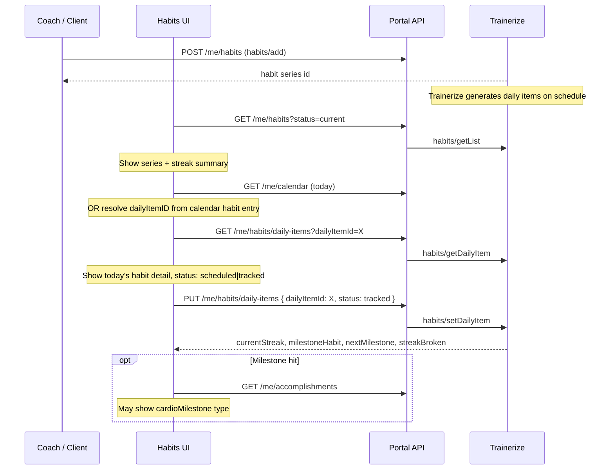
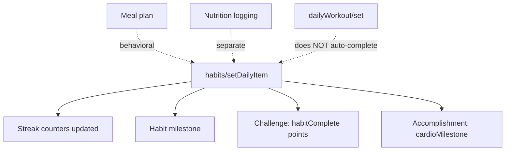

# Workflow — Habits & Streak Tracking

How habit **series** are assigned, how **daily check-ins** work, and how **streaks** and **habit milestones** are tracked.

**API reference:** [`../api-reference/habits/`](../api-reference/habits/)

---

## Two-level model

Habits have a **series** (the assignment) and **daily items** (each scheduled day):

| Level | ID field | API | Analogy |
|-------|----------|-----|---------|
| **Habit series** | `habits[].id` in `getList` | `habits/getList`, `habits/add` | Training plan (template) |
| **Daily item** | `dailyItemID` / daily item `id` | `habits/getDailyItem`, `habits/setDailyItem` | Daily workout instance |

**Common mistake:** Passing habit series `id` as `dailyItemID` → errors. See [`trainerize-api-issue-2.md`](../api-reference/trainerize-api-issue-2.md).

---

## Habit types

Built-in types include nutrition, activity, sleep, and custom:

| Category | Examples |
|----------|----------|
| Nutrition | `eatProtein`, `eatVeggie`, `followPortionGuide`, `practiceEatingSlowly`, `drinkOnlyZeroCalorieDrink` |
| Activity | `takeAMoreActiveRoute`, `makeItEasierToWorkout`, `doAnEnjoyableActivity`, `rewardYourselfAfterAWorkout` |
| Wellness | `prioritizeSelfCare`, `digitalDetoxOneHourBeforeBed`, `practiceBedtimeRitual` |
| Custom | `customHabit` with `name` and optional `customTypeID` |

Nutrition habits may include `habitsDetail.nutritionPortion` (hand portion guide: carbs, protein, fat, veggies counts).

---

## Full lifecycle



---

## Progress tracking — series level

`GET /me/habits?status=current` → `habits/getList`

Each habit series returns aggregate progress:

| Field | Meaning |
|-------|---------|
| `currentStreak` | Consecutive days tracked |
| `longestStreak` | All-time best streak |
| `longestStreakStartDate` / `EndDate` | Window of best streak |
| `totalItems` | Total scheduled check-ins in current period |
| `totalCompleted` | Completed in current period |
| `totalCompletedAllTime` | Lifetime completions |
| `streakBroken` | Whether current streak was recently broken |
| `startDate` / `endDate` | Assignment window |
| `repeatDetail.dayOfWeeks` | Which days habit is scheduled |

**UI progress bar:** `totalCompleted / totalItems` for period completion; separate badge for `currentStreak`.

Filter by status:

| `status` param | Shows |
|----------------|-------|
| `current` | Active habits (default) |
| `upcoming` | Not yet started |
| `past` | Ended habits |

---

## Progress tracking — daily check-in

### Load today's item

```
GET /api/trainerize/me/habits/daily-items?dailyItemId=77594599
```

Response highlights:

| Field | Use |
|-------|-----|
| `id` | Daily item ID (same as query param) |
| `date` | Which day |
| `status` | `scheduled` or `tracked` |
| `name`, `description` | Display |
| `habit[]` | Parent series info with live streak stats |

### Mark complete

```
PUT /api/trainerize/me/habits/daily-items
{
  "dailyItemId": 77594599,
  "status": "tracked"
}
```

### Response — immediate streak update

| Field | Meaning |
|-------|---------|
| `currentStreak` | Updated streak after this check-in |
| `longestStreak` | Updated all-time best |
| `previousLongestStreak` | Prior best (for comparison UI) |
| `streakBroken` | `false` on success; `true` if streak was broken earlier |
| `milestoneHabit` | Milestone just hit (0 if none) |
| `nextMilestone` | Next streak milestone target (e.g. 7, 14, 30 days) |

**Show these immediately** — do not wait for accomplishments fetch.

### Undo / untrack

```
DELETE /api/trainerize/me/habits/daily-items
{ "dailyItemId": 77594599 }
```

Effect on streak recalculation is handled by Trainerize server-side.

---

## Habit milestones vs workout milestones

| | Habit milestone | Workout milestone |
|--|-----------------|-------------------|
| **Trigger** | `habits/setDailyItem` | `dailyWorkout/set` |
| **Based on** | Streak length | Cumulative exercise distance/time |
| **Response fields** | `milestoneHabit`, `nextMilestone` | `milestones[]`, `milestoneWorkout` |
| **Accomplishment type** | `cardioMilestone` | `milestone` |

---

## Links to other features



| Feature | Relationship |
|---------|--------------|
| **Challenges** | Each tracked habit → `rules.habitComplete` points |
| **Accomplishments** | Streak milestones → `cardioMilestone` with `habitStatsID`, `streak`, `habitType` |
| **Nutrition habits** | Behavioral check-in; does **not** replace `dailyNutrition/get` logging |
| **Workouts** | Completing a workout does **not** auto-check `rewardYourselfAfterAWorkout` — separate habit check-in required |
| **Goals** | Independent — text goal progress is manual; nutrition goals use nutrition logs |

---

## Creating habits (client self-service)

```
POST /api/trainerize/me/habits
{
  "type": "customHabit",
  "name": "Drink 2L water",
  "startDate": "2026-06-01",
  "durationType": "week",
  "duration": 4,
  "repeatDetail": {
    "dayOfWeeks": ["monday", "tuesday", "wednesday", "thursday", "friday"]
  }
}
```

Coaches typically assign habits via Trainerize app; clients can add custom habits via API where permitted.

---

## Resolving `dailyItemID` — two paths

### Path A — Calendar (recommended for Today view)

```
GET /me/calendar?startDate=today&endDate=today
→ find habit-type calendar entry
→ use itemID as dailyItemId
```

### Path B — Habits list + date (if calendar exposes habit schedule)

Some integrations derive today's items from series `repeatDetail.dayOfWeeks` + `startDate`. Calendar is more reliable because Trainerize generates exact daily item IDs.

---

## Known issue — Partner API privileges

`habits/getDailyItem`, `setDailyItem`, `deleteDailyItem` may return:

```json
{ "code": 403, "message": "No privilege to access user habits." }
```

`habits/getList` and `habits/add` may still work. Track in [`trainerize-api-issue-2.md`](../api-reference/trainerize-api-issue-2.md).

**Fallback for v1:** Show series-level streak from `getList`; disable check-in until Trainerize confirms Partner API scope.

---

## Portal route reference

| Action | Method | Route |
|--------|--------|-------|
| List habit series | `GET` | `/trainerize/me/habits` |
| Add habit | `POST` | `/trainerize/me/habits` |
| Get daily item | `GET` | `/trainerize/me/habits/daily-items` |
| Track (check-in) | `PUT` | `/trainerize/me/habits/daily-items` |
| Untrack / delete item | `DELETE` | `/trainerize/me/habits/daily-items` |

Query params for list: `status`, `start`, `count`.

---

## Test checklist

- [ ] Habit series list shows streak fields
- [ ] `dailyItemId` from calendar works for check-in (not series `id`)
- [ ] `PUT` with `status: "tracked"` returns updated streak
- [ ] `milestoneHabit > 0` shows celebration at streak thresholds
- [ ] Re-fetch series list shows updated `currentStreak`
- [ ] Challenge points increase after habit check-in
- [ ] `cardioMilestone` appears in accomplishments after milestone
