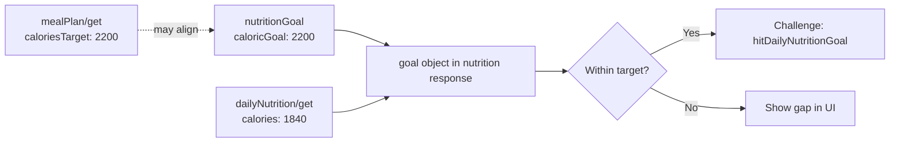
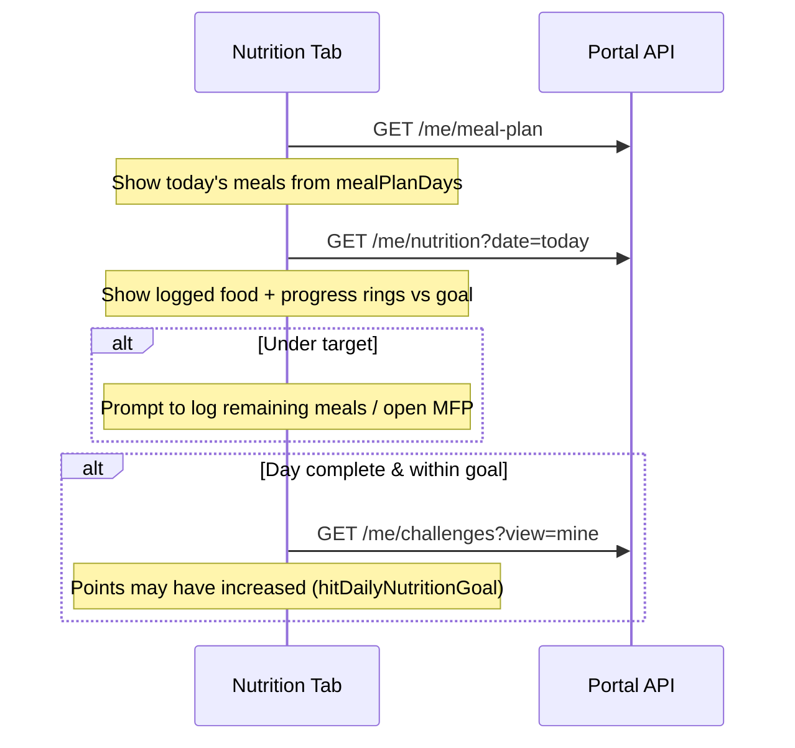

# Workflow — Meal Plans & Nutrition

How **meal plans** are assigned and generated, how **daily nutrition logging** works, and how nutrition ties to **goals** and **challenges**.

**API reference:** [`../api-reference/mealPlan/`](../api-reference/mealPlan/) · [`../api-reference/dailyNutrition/`](../api-reference/dailyNutrition/)

---

## Three nutrition layers

| Layer | Purpose | Writable? | Portal routes |
|-------|---------|-----------|---------------|
| **Meal plan** | Prescriptive menu — what to eat | Yes (generate/set/delete) | `/me/meal-plan/*` |
| **Nutrition goal** | Calorie/macro targets — the scoreboard | Yes (goals API) | `/me/goals` |
| **Daily nutrition log** | Actual intake — what was eaten | Via MFP/Fitbit/TZ logging | `/me/nutrition/*` |

These are **related but separate** in Trainerize. The UI should show how they connect without merging APIs.

---

## Meal plan types

| `mealPlanType` | Source | Content |
|----------------|--------|---------|
| `planner` | Trainerize meal planner | `mealPlanDays[]` with breakfast/lunch/dinner/snacks, recipes, macros |
| `file` | PDF attachment | `attachment` object with download token |
| `en` | Evolution Nutrition | `enMealPlanID` external reference |

---

## Flow 1 — View assigned meal plan

```
GET /api/trainerize/me/meal-plan
```

Optional: `?mealPlanId=3333` to fetch a specific plan by ID.

Without `mealPlanId`, returns the plan assigned to the linked client (`mealPlan/get` with `userid`).

**Response highlights:**

| Field | Use |
|-------|-----|
| `id` | Meal plan ID |
| `mealPlanName` | Display title |
| `mealPlanType` | Render strategy (planner vs PDF vs EN) |
| `caloriesTarget` | Daily calorie target (planner type) |
| `macroSplit` | `balanced`, `lowCarb`, `lowFat`, `highProtein` |
| `mealsPerDay` | 3–6 |
| `mealPlanDays[]` | Rotating day menu |
| `mealPlanDays[].breakfast` / `lunch` / `dinner` / `snack1` / `snack2` | Meal objects with recipes, nutrients, media |

**Day rotation UI:** Use `mealPlanDays[].day` (1, 2, 3…) cycled by calendar day since plan start, or show all sample days if `sampleDays` is set.

---

## Flow 2 — Client generates own meal plan

```
POST /api/trainerize/me/meal-plan/generate
{
  "caloriesTarget": 2200,
  "macroSplit": "balanced",
  "mealsPerDay": 4,
  "sampleDays": 3,
  "excludes": ["dairy", "gluten"]
}
```

| Constraint | Value |
|------------|-------|
| `caloriesTarget` | 1400–3000 (3 meals) up to 2000–4000 (6 meals) — see API doc |
| `mealsPerDay` | 3–6 |
| `sampleDays` | 1–3 |
| `excludes` | Allergen/restriction list |

Response shape matches `mealPlan/get` — full generated plan with `mealPlanDays[]`.

**After generate:** Plan is assigned to client; subsequent `GET /me/meal-plan` returns it.

---

## Flow 3 — Update or remove meal plan

```
PUT /api/trainerize/me/meal-plan
{
  "mealPlanName": "My custom plan",
  "caloricGoal": 2200,
  ...
}

DELETE /api/trainerize/me/meal-plan
```

`mealPlan/set` supports PDF upload (`type: TRZ` + attachment) and Evolution Nutrition (`type: EN`) — typically coach-driven.

---

## Flow 4 — Daily nutrition logging & compliance

### List view (date range)

```
GET /api/trainerize/me/nutrition/logs?startDate=2026-06-01%2000:00:00&endDate=2026-06-07%2023:59:59
```

Returns daily summaries — calories, macros per day (list view, no full food detail).

### Detail view (single day)

```
GET /api/trainerize/me/nutrition?date=2026-06-04
```

**Key response structure:**

```json
{
  "nutrition": {
    "date": "2026-06-04",
    "calories": 1840,
    "carbsGrams": 210,
    "proteinGrams": 140,
    "fatGrams": 55,
    "meals": [
      {
        "name": "breakfast",
        "foods": [{ "name": "Oatmeal", "calories": 350, ... }],
        "caloriesSummary": 350
      }
    ],
    "goal": {
      "caloricGoal": 2200,
      "carbsGrams": 250,
      "proteinGrams": 150,
      "fatGrams": 70,
      "nutritionDeviation": 10
    },
    "source": "trainerize"
  }
}
```

| Field | Use |
|-------|-----|
| `meals[]` | Logged meals with `foods[]` |
| `goal` | **Day's targets** — compare actual vs goal for rings |
| `source` | `trainerize`, `mFP`, `fitbit` |

### Custom foods (manual logging)

CRUD via `/me/nutrition/custom-foods` — create foods, then log through Trainerize app flow or future set endpoints.

See [`../../frontend/trainerize/nutrition-photos-appointments-apis.md`](../../frontend/trainerize/nutrition-photos-appointments-apis.md).

---

## How meal plan connects to nutrition goal



| Question | Answer |
|----------|--------|
| Does following meal plan auto-log nutrition? | **No** — client still logs or syncs MFP/Fitbit |
| Which target for compliance UI? | `dailyNutrition/get → goal` object |
| Can meal plan and goal differ? | **Yes** — coach may set different values; prefer goal for rings |
| Does meal plan affect challenge points? | **Indirectly** — only if logging meets nutrition goal |

---

## How meal plan connects to habits

Nutrition **habits** (`eatProtein`, `followPortionGuide`, etc.) are **behavioral check-ins**, not automatic meal plan compliance:

| Meal plan | Nutrition habit |
|-----------|-----------------|
| Shows recipes and portions | "Did you eat protein today?" ✓/✗ |
| Static assignment | Streak tracked via `habits/setDailyItem` |
| No dailyItemID | Has dailyItemID from calendar |

UI can cross-link: "Today's meal plan emphasizes protein" near an `eatProtein` habit card — but APIs remain separate.

---

## Coach snapshot (Tier B)

`GET /trainerize/trainer/clients/summary` includes:

```json
{
  "mealPlan": { "id": 3333, "name": "Lean Bulk", "type": "file" },
  "goal": { /* nutrition goal fields */ },
  "weeklyStats": [{
    "nutritionCompleted": 5,
    "nutritionCompliance": 71
  }],
  "mfpConnected": true
}
```

Useful for coach monitoring; no Tier A `/me/summary` yet.

---

## End-to-end nutrition day workflow



---

## Portal route reference

| Action | Method | Route |
|--------|--------|-------|
| Get meal plan | `GET` | `/trainerize/me/meal-plan` |
| Generate meal plan | `POST` | `/trainerize/me/meal-plan/generate` |
| Update meal plan | `PUT` | `/trainerize/me/meal-plan` |
| Delete meal plan | `DELETE` | `/trainerize/me/meal-plan` |
| Nutrition logs (range) | `GET` | `/trainerize/me/nutrition/logs` |
| Nutrition detail (day) | `GET` | `/trainerize/me/nutrition` |
| Custom foods CRUD | various | `/trainerize/me/nutrition/custom-foods` |
| Nutrition goal CRUD | various | `/trainerize/me/goals` |

---

## Test checklist

- [ ] `GET /me/meal-plan` returns planner days with meals and macros
- [ ] `POST /me/meal-plan/generate` creates assignable plan
- [ ] `GET /me/nutrition?date=` shows meals and `goal` object
- [ ] Calorie ring matches `calories / goal.caloricGoal`
- [ ] MFP-connected user shows `source: mFP` on nutrition entry
- [ ] Challenge points update after nutrition-compliant day (re-fetch)
- [ ] Meal plan display works for PDF type (attachment URL/token)
