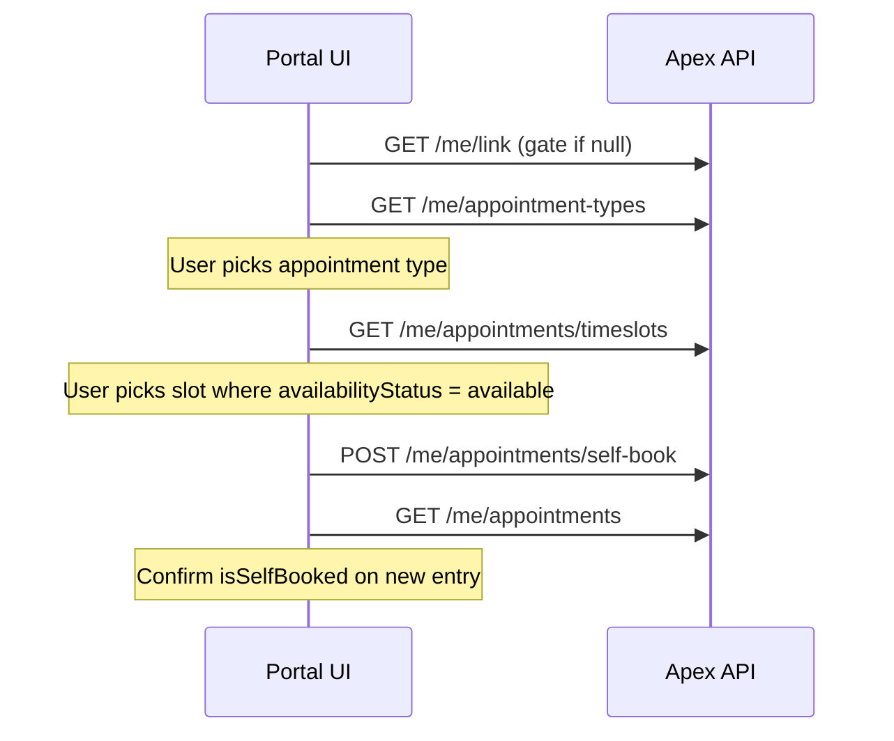

# Trainerize — Appointment Self-Book (Frontend Reference)

> **Audience:** Frontend developers building the client appointment booking flow (pick type → pick date → pick slot → confirm).
> **Base path:** `/api` prefix (e.g. `GET /api/trainerize/me/appointments/timeslots`).
> **Auth:** Session cookie `apex_access_token` on every request. Missing/invalid token → `401`.
> **Envelope:** `{ success: true, data: ... }` on success; `{ success: false, message: "..." }` on error.
>
> **Prerequisite:** User must have a Trainerize link (`GET /trainerize/me/link` → `data` not `null`).

These endpoints proxy the Trainerize Partner API **self-booking** flow. The backend injects the linked client's Trainerize ID and assigned trainer ID — **do not send `trainerID` or `clientID` in requests**.

For manual booking when you already know exact start/end times, see [`nutrition-photos-appointments-apis.md`](./nutrition-photos-appointments-apis.md) → `POST /trainerize/me/appointments` (`appointment/add`).

---

## When to use which booking API

| Flow | Endpoint | Use when |
|------|----------|----------|
| **Self-book (this doc)** | `GET …/timeslots` + `POST …/self-book` | User picks from trainer availability (matches Trainerize native app) |
| **Manual book** | `POST /trainerize/me/appointments` | You already have `startDate` + `endDate` and trainer/client IDs |

---

## End-to-end UI flow



| Step | Endpoint | Purpose |
|------|----------|---------|
| 0 | `GET /trainerize/me/link` | Ensure user is linked |
| 1 | `GET /trainerize/me/appointment-types` | List session types (`ignoreDeleted=true` recommended) |
| 2 | `GET /trainerize/me/appointments/timeslots` | Fetch bookable slots for date range |
| 3 | `POST /trainerize/me/appointments/self-book` | Book selected slot |
| 4 | `GET /trainerize/me/appointments` | Verify booking in schedule |

Optional: `GET /trainerize/me/appointment-types/detail?appointmentTypeId=` for full `actionInfo` (video, duration, cancel window) before booking.

---

## `locationId` requirement

Both self-book endpoints require **`locationId`**. There is no portal location-list route yet — supply it from:

- Studio configuration (env / CMS) if the business has a single location
- Trainerize admin / support for the numeric location ID
- A future `GET /trainerize/me/locations` endpoint (not implemented)

Virtual appointment types may still require a location ID on the wire — confirm with your studio setup.

---

## Related read endpoints

| Method | Path | Purpose |
|--------|------|---------|
| `GET` | `/trainerize/me/appointment-types` | List types — query: `start`, `count`, `ignoreDeleted`, `ignoreVideoCall`, `ignoreExternal` |
| `GET` | `/trainerize/me/appointment-types/detail` | Single type — query: `appointmentTypeId` |
| `GET` | `/trainerize/me/appointments` | List booked appointments — query: `startDate`, `endDate` |

**Filtering types for self-book UI:** Prefer types where `actionInfo.isActive !== false`. Use `ignoreExternal=true` on the types list if you only want native Trainerize types. Interpret `actionInfo.isPrivate` per product rules (Trainerize doc: client bookable flag).

---

## `GET /trainerize/me/appointments/timeslots`

Returns available appointment timeslots for a trainer, location, and appointment type over a date range (Trainerize `availability/getAvailableTimeslots`).

**Response status:** `200 OK`

### Query params

| Param | Type | Required | Description |
|-------|------|----------|-------------|
| `locationId` | `number` | Yes | Studio location ID |
| `appointmentTypeId` | `number` | Yes | From appointment types list |
| `startTime` | `string` | Yes | Range start — `YYYY-MM-DD HH:MI:SS` (e.g. `2026-06-06 00:00:00`) |
| `endTime` | `string` | Yes | Range end — same format |

**Example:**

```
GET /api/trainerize/me/appointments/timeslots?locationId=267853&appointmentTypeId=2592923&startTime=2026-06-06%2000:00:00&endTime=2026-06-21%2000:00:00
```

### Response `data`

```json
{
  "dailyTimeslots": {
    "2026-06-08 00:00:00": {
      "availableCount": 1,
      "timeslots": [
        {
          "timeslot": "2026-06-08 07:15:00",
          "availabilityStatus": "available"
        }
      ]
    },
    "2026-06-06 00:00:00": {
      "availableCount": 0,
      "timeslots": [
        {
          "timeslot": "2026-06-06 07:15:00",
          "availabilityStatus": "unavailable_BookingWindow"
        }
      ]
    }
  }
}
```

| Field | Description |
|-------|-------------|
| `dailyTimeslots` | Map of day keys (midnight datetime string) → day object |
| `dailyTimeslots[day].availableCount` | Count of **bookable** slots that day |
| `dailyTimeslots[day].timeslots[]` | All slot entries for the day |
| `timeslots[].timeslot` | Slot start — pass this value to self-book as `appointmentTime` |
| `timeslots[].availabilityStatus` | Slot status (see below) |

### `availabilityStatus` values

| Value | UI action |
|-------|-----------|
| `available` | Show as selectable; use `timeslot` in self-book request |
| `unavailable_BookingWindow` | Show disabled — outside booking window (too soon / too far) |
| `unavailable_*` (other) | Treat as not bookable unless product says otherwise |


Days with no trainer availability may still appear with `availableCount: 0`.

---

## `POST /trainerize/me/appointments/self-book`

Books an appointment at a specific slot time (Trainerize `appointment/selfBook`).

**Response status:** `201 Created`

### Request body

```json
{
  "locationId": 267853,
  "appointmentTypeId": 2592923,
  "appointmentTime": "2026-06-09 07:15:00"
}
```

| Field | Type | Required | Description |
|-------|------|----------|-------------|
| `locationId` | `number` | Yes | Same location used in timeslots query |
| `appointmentTypeId` | `number` | Yes | Same type used in timeslots query |
| `appointmentTime` | `string` | Yes | Exact `timeslot` string from timeslots response |

**Do not send:** `trainerID`, `clientID` — injected by the backend from settings + link.

### Response `data`

```json
{
  "code": 0,
  "message": "Appointment booked."
}
```

There is **no appointment `id`** in this response. After success, call `GET /trainerize/me/appointments` to load the new booking (look for matching `startDate` / `appointmentType` and `isSelfBooked: true`).

---

## Verify booking

```
GET /api/trainerize/me/appointments?startDate=2026-06-01%2000:00:00&endDate=2026-06-30%2023:59:59
```

Useful fields on list items:

| Field | Meaning |
|-------|---------|
| `startDate` / `endDate` | UTC appointment window |
| `appointmentType` | Nested type name, duration, `actionInfo` |
| `isSelfBooked` | `true` when client booked via self-book flow |
| `organizer` | Assigned trainer |
| `cancellationStatus` | Read-only: `unrequested`, `requested`, `denied` |
| `allowCancelBeforeDate` | Cancel deadline (UTC); may be `null` |

There is **no** portal cancel/reschedule endpoint — cancellation state is read-only from Trainerize.

---

## Error reference

| HTTP | Typical cause |
|------|----------------|
| `400` | Invalid query/body (Zod); invalid or unavailable slot on self-book |
| `401` | Missing or expired session |
| `404` | No Trainerize link |
| `502` | Trainerize Partner API error |

---

## Suggested UI patterns

**Week picker:** Set `startTime` to start of visible week (midnight) and `endTime` to end of range (e.g. +14 days). Re-fetch timeslots when the user changes week or appointment type.

**Slot grid:** Group by day key from `dailyTimeslots`. Only enable buttons where `availabilityStatus === 'available'`.

**Confirm step:** Show type name, `appointmentTime`, and location label (from your config). On success, navigate to appointments list or detail.

**Empty states:**

- No types → onboarding / contact trainer
- No `available` slots in range → suggest another week or type
- Self-book error after slot was taken → refresh timeslots and ask user to pick again

**Datetime format:** Use `YYYY-MM-DD HH:MI:SS` consistently for timeslots and self-book (matches Trainerize samples). URL-encode spaces in query strings (`%20`).

---

## Quick reference

```
Gate              GET /me/link

Browse types      GET /me/appointment-types?ignoreDeleted=true
Type detail       GET /me/appointment-types/detail?appointmentTypeId=

Load slots        GET /me/appointments/timeslots?locationId=&appointmentTypeId=&startTime=&endTime=
Book slot         POST /me/appointments/self-book  { locationId, appointmentTypeId, appointmentTime }
Verify            GET /me/appointments?startDate=&endDate=
```
