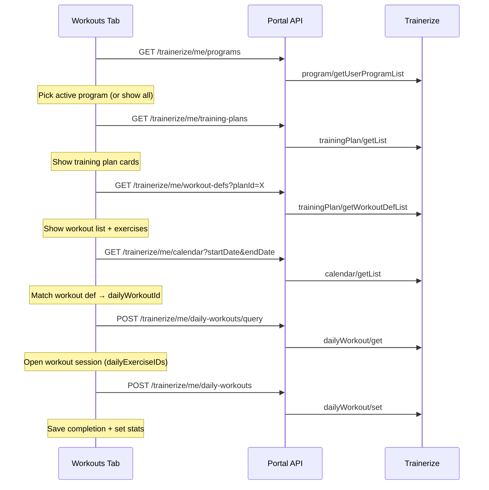

# Client Workouts Tab — API Flow

How the portal loads training plans, displays workouts with exercises, and saves completion data via Trainerize.

**Audience:** Frontend and backend developers integrating the Workouts tab.  
**Scope:** Tier A client routes (`/trainerize/me/...`).  
**Related docs:** `api-reference/program-apis.md`, `api-reference/training-plan-apis.md`, `api-reference/workout-defs.md`, `api-reference/daily-workout-apis.md`, `implementation-plans/trainerize-client-http-implementation-plan.md`.

---

## Mental model

Trainerize splits **templates** from **scheduled instances**:

| Layer | Trainerize resource | Role | Has dates? | Has logged sets? |
|-------|----------------------|------|------------|------------------|
| Program | `program` | Top-level container assigned to the client | Yes (`startDate` / `endDate` on enrollment) | No |
| Training plan | `trainingPlan` | Block of training content inside a program (or standalone on client) | Yes | No |
| Workout definition | `workoutDef` | Blueprint: exercises, sets, targets, instructions | No | No |
| Daily workout | `dailyWorkout` | Scheduled instance on a specific date — what the client actually performs | Yes | Yes |

**Rule:** Use **workout defs** to show structure. Use **daily workouts** to open a session and save completion.

---

## End-to-end flow



---

## Screen 1 — Workouts tab: training plans

**Goal:** User opens Workouts and sees training plans from their program(s).

### APIs

| Step | Portal route | Trainerize endpoint | Purpose |
|------|--------------|---------------------|---------|
| 1 | `GET /trainerize/me/programs` | `program/getUserProgramList` | Programs the client is enrolled in |
| 2 | `GET /trainerize/me/training-plans` | `trainingPlan/getList` | All training plans for the linked client |

### Response fields to use

**Programs** (`userPrograms[]`):

- `id` — program ID
- `name`
- `startDate`, `endDate`
- `durationType` — `phased` or `ondemand`
- `subscribeType` — `core` or `addon`

**Training plans** (`plans[]`):

- `id` — training plan ID (use as `planId` in later calls)
- `name`
- `startDate`, `endDate`, `duration`, `durationType`

### Program-scoped plans (gap)

To list plans **inside one program** only, Trainerize exposes `program/getTrainingPlanList` (`id` = program ID). That endpoint is implemented on the **trainer** Tier B surface (`listTrainerizeProgramTrainingPlans`), not yet on `/trainerize/me/...`.

**Workarounds for v1:**

- If clients typically have one program, `GET /training-plans` is often sufficient.
- For multi-program UX, add a client route such as `GET /trainerize/me/programs/training-plans?programId=123` wrapping `program/getTrainingPlanList`.

---

## Screen 2 — Plan detail: workouts and exercises

**Goal:** User taps a training plan and sees workouts with exercises.

### API

```
GET /trainerize/me/workout-defs?planId={trainingPlanID}&count=50
```

Optional query params: `searchTerm`, `start`, `count`, `filter`.

| Portal query | Trainerize body |
|--------------|-----------------|
| `planId` | `planID` |

### Response fields to use

**Workouts** (`workout[]`):

- `id` — workout definition ID
- `duration`, `workoutType` (`circuit` | `normal`)
- `exercises[]` — enough for list and detail UI in most cases

**When to call `workoutDef/get`:** Only if you need full exercise media (videos, thumbnails) not present in the list response. There is no client `/workout-defs/query` route today; that would require a new endpoint or calling through an existing trainer route.

### Frontend state

Keep per workout: `workoutDefId`, `name`, `exercises[]`, and the parent `planId`.

---

## Screen 3 — Open workout session

**Goal:** User taps a workout to perform it. Load the **scheduled daily instance**, not just the template.

Workout defs do not have `dailyExerciseID` or completion status. You must resolve a **daily workout ID** first.

### Step A — Find the daily workout ID from calendar

```
GET /trainerize/me/calendar?startDate=YYYY-MM-DD&endDate=YYYY-MM-DD&unitDistance=km&unitWeight=kg
```

Search calendar events for an item where:

- `type === "workout"`
- `trainingPlanID` matches the selected plan (when available on the event)
- `detail.workoutID` matches the workout definition `id` from Screen 2  
  **or** match by the date the user selected (e.g. today)

Use `itemID` from the matching calendar entry as **`dailyWorkoutId`**.

Program template calendar (`program/getCalendarList`) uses day numbers (`day: 1, 2, …`) and is for coach/template views. Client execution should use **`calendar/getList`** (date-based).

### Step B — Hydrate the session

```
POST /trainerize/me/daily-workouts/query
Content-Type: application/json

{
  "dailyWorkoutIds": [12345]
}
```

### Response fields to use

- `id` — daily workout ID (required on save)
- `workoutID` — links to workout definition
- `fromProgram` — whether generated from program enrollment
- `date`, `status` — `scheduled` | `checkedIn` | `tracked`
- `exercises[].dailyExerciseID` — **required when updating**
- `exercises[].def` — exercise name/description
- `exercises[].stats[]` — existing logged sets (if any)

Build the active workout screen from this payload.

### Frontend state

Keep: `dailyWorkoutId`, full daily workout object, and map `workoutID` back to the workout def for display consistency.

---

## Screen 4 — Complete workout

**Goal:** User logs sets/reps and marks the workout complete.

### API

```
POST /trainerize/me/daily-workouts
Content-Type: application/json

{
  "unitWeight": "kg",
  "unitDistance": "km",
  "dailyWorkouts": [
    {
      "id": 12345,
      "name": "Upper Body Strength",
      "date": "2026-06-03",
      "type": "workoutRegular",
      "status": "tracked",
      "style": "normal",
      "exercises": [
        {
          "dailyExerciseID": 10282588,
          "def": {
            "id": 154,
            "name": "Bench Press",
            "description": "Flat bench barbell press"
          },
          "sets": 3,
          "target": "Heavy",
          "targetDetail": "5x5",
          "supersetType": "none",
          "restTime": 90,
          "recordType": "strength",
          "type": "system",
          "stats": [
            { "setID": 1, "reps": 10, "weight": 80 },
            { "setID": 2, "reps": 8, "weight": 85 }
          ]
        }
      ]
    }
  ]
}
```

### Important rules

1. **Update existing instances:** Use `id > 0` from the query response. Program-assigned workouts are already scheduled; prefer updating over creating (`id: 0`).
2. **Preserve `dailyExerciseID`:** Send the IDs from `daily-workouts/query`. Use `0` only for newly added exercises within the session.
3. **Status progression:** Typical flow is `scheduled` → `checkedIn` (optional) → `tracked` (completed).
4. **Comments / RPE:** `comments` with `comment` and `rpe` should only be sent on **first completion** (see `daily-workout-apis.md`).
5. **User ID:** Do not send Trainerize `userId` from the client; the portal injects it from the account link.

### Response

May include `dailyWorkoutIDs`, `milestones`, and `brokenRecords` for accomplishments UI.

---

## Quick reference — portal routes

| User action | Method | Route |
|-------------|--------|-------|
| List my programs | `GET` | `/trainerize/me/programs` |
| List my training plans | `GET` | `/trainerize/me/training-plans` |
| List workouts in a plan | `GET` | `/trainerize/me/workout-defs?planId=` |
| Calendar (find daily workout IDs) | `GET` | `/trainerize/me/calendar` |
| Load workout session | `POST` | `/trainerize/me/daily-workouts/query` |
| Save / complete workout | `POST` | `/trainerize/me/daily-workouts` |

All routes require authentication (`requireAuth`) and a linked Trainerize account (404 if unlinked).

---

## ID chain

```
program.id
  └── trainingPlan.id  (planId)
        └── workoutDef.id  (template — from getWorkoutDefList)
              └── dailyWorkout.workoutID  (links template → instance)
                    └── dailyWorkout.id  (from calendar itemID)
                          └── dailyExerciseID  (per exercise, for set)
```

---

## Known limitations

| Issue | Impact | Workaround |
|-------|--------|------------|
| No `program/getTrainingPlanList` on `/me` | Cannot filter plans by program without a new route | Use flat `GET /training-plans` or add client endpoint |
| No `dailyWorkout/getList` | No direct “history by date range” | `calendar/getList` → extract IDs → `daily-workouts/query` |
| No `workoutDef/getList` | No global workout library browse | Always go through `planId` on workout-defs |
| `dailyWorkout/set` with `id: 0` | Creating ad-hoc workouts can be fragile | Prefer updating scheduled instances (`id > 0`) |

See `api-reference/trainerize-api-issues.md` for Trainerize-side bugs and edge cases.

---

## Suggested UI states

| State | Source |
|-------|--------|
| `programs[]` | `GET /programs` |
| `selectedProgramId` | User selection |
| `trainingPlans[]` | `GET /training-plans` (or future program-scoped route) |
| `selectedPlanId` | User selection |
| `workoutDefs[]` | `GET /workout-defs?planId=` |
| `activeDailyWorkout` | `POST /daily-workouts/query` |
| `calendarEvents[]` | `GET /calendar` (cache for ID resolution) |

---

## Test checklist

- [ ] Linked user sees programs and training plans on Workouts tab
- [ ] Unlinked user receives 404 on all `/trainerize/me/...` workout routes
- [ ] Plan tap loads workout defs with exercises
- [ ] Workout tap resolves a daily workout ID from calendar
- [ ] Session screen shows exercises with `dailyExerciseID`
- [ ] Completion POST sets `status: "tracked"` and persists `stats`
- [ ] Re-opening completed workout shows prior stats from query
