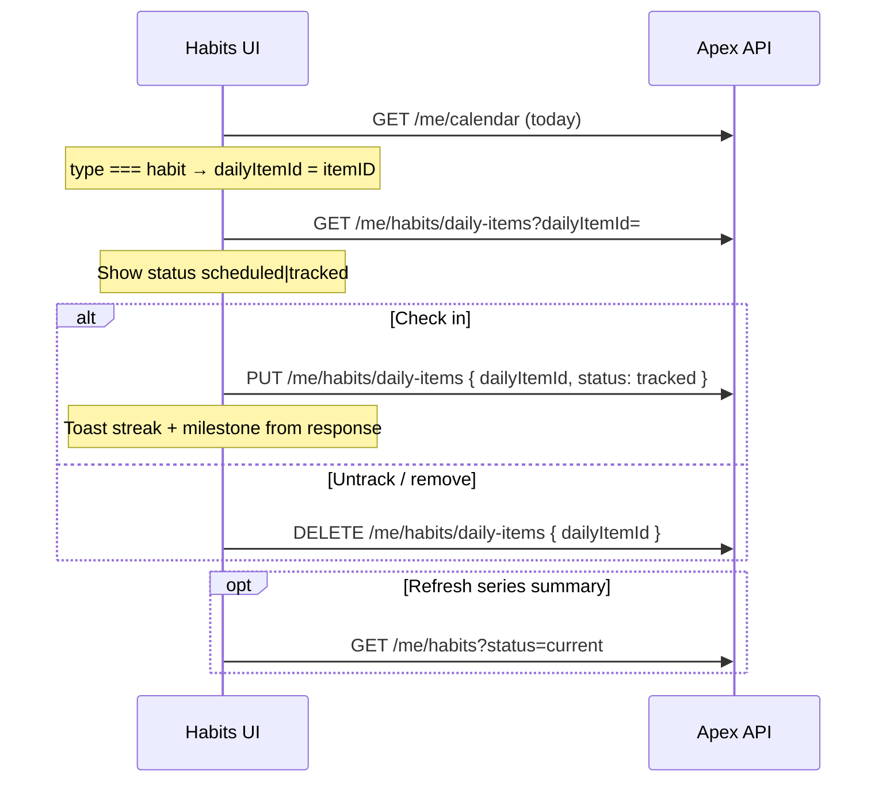

# Trainerize — Habits Daily Items (Frontend Reference)

> **Audience:** Frontend developers building habit check-in / untrack flows.
> **Base path:** `/api` prefix (e.g. `GET /api/trainerize/me/habits/daily-items`).
> **Auth:** Session cookie `apex_access_token` on every request. Missing/invalid token → `401`.
> **Envelope:** `{ success: true, data: ... }` on success; `{ success: false, message: "..." }` on error.
>
> **Prerequisite:** User must have a Trainerize link (`GET /trainerize/me/link` → `data` not `null`).

These endpoints proxy Trainerize `habits/getDailyItem`, `habits/setDailyItem`, and `habits/deleteDailyItem` for the **linked client only**. The backend injects the client's Trainerize user ID — **do not send `userID` / `userId`**.

---

## Getting `dailyItemId` from the calendar

There is no “list habits for today” API. Use the **calendar** to discover today's habit check-ins:

1. Call `GET /trainerize/me/calendar` for the target date range (typically today).
2. In the calendar payload, find entries where **`type` is `"habit"`**.
3. Use that entry's **`itemID`** as **`dailyItemId`** in all three daily-item

**Important — do not confuse IDs:**

| ID | Source | Used for |
|----|--------|----------|
| **`itemID`** (calendar, `type === "habit"`) | `GET /me/calendar` | ✅ `dailyItemId` on daily-item APIs |
| **`habits[].id`** (habit series) | `GET /me/habits` (`habits/getList`) | ❌ **Not** `dailyItemId` — series-level only |
| **`id`** on `getDailyItem` response | `GET /me/habits/daily-items` | Same daily item — echo of `dailyItemId` |

Using a habit **series** id instead of a **daily item** id will fail at Trainerize.

**Example calendar flow:**

```
GET /api/trainerize/me/calendar?startDate=2026-06-04&endDate=2026-06-04&unitDistance=km&unitWeight=kg
→ find { type: "habit", itemID: 77594599, date: "2026-06-04", ... }
→ dailyItemId = 77594599
```

Use `unitDistance` and `unitWeight` from `GET /me/settings` (same as other calendar calls). See [`client-apis.md`](./client-apis.md) → `GET /trainerize/me/calendar`.

---

## Routes overview

| Method | Path | Trainerize upstream | Purpose |
|--------|------|---------------------|---------|
| `GET` | `/trainerize/me/habits/daily-items` | `habits/getDailyItem` | Load one daily habit item |
| `PUT` | `/trainerize/me/habits/daily-items` | `habits/setDailyItem` | Track / check-in (`status: "tracked"`) |
| `DELETE` | `/trainerize/me/habits/daily-items` | `habits/deleteDailyItem` | Remove daily item (untrack / delete) |

Related (not covered in depth here):

| Method | Path | Purpose |
|--------|------|---------|
| `GET` | `/trainerize/me/habits` | Habit **series** list + streak summary (`status`, `start`, `count`) |
| `POST` | `/trainerize/me/habits` | Add habit series |
| `GET` | `/trainerize/me/calendar` | Discover today's `dailyItemId` values |

---

## Suggested UI flow



---

## `GET /trainerize/me/habits/daily-items`

Load a single habit **daily item** (today's check-in target).

**Response status:** `200 OK`

### Query params

| Param | Type | Required | Description |
|-------|------|----------|-------------|
| `dailyItemId` | `number` | Yes | From calendar habit entry `itemID` |

**Example:**

```
GET /api/trainerize/me/habits/daily-items?dailyItemId=77594599
```

### Response `data`

Trainerize payload (typical shape):

```json
{
  "id": 77594599,
  "userID": 29812593,
  "type": "customHabit",
  "name": "Drink more water",
  "description": "8 glasses per day",
  "date": "2026-06-04",
  "status": "scheduled",
  "habit": [
    {
      "id": 123456,
      "type": "customHabit",
      "name": "Drink more water",
      "currentStreak": 2,
      "longestStreak": 5,
      "totalItems": 18,
      "totalCompleted": 9,
      "streakBroken": false,
      "repeatDetail": { "dayOfWeeks": ["monday", "tuesday", "wednesday"] }
    }
  ]
}
```

| Field | Use in UI |
|-------|-----------|
| `id` | Daily item id (matches query `dailyItemId`) |
| `date` | Which day this item is for |
| `status` | `scheduled` = not checked in; `tracked` = completed |
| `name`, `description`, `type` | Display copy |
| `habit[]` | Parent series stats (`currentStreak`, `longestStreak`, etc.) |

**Note:** `habit[].id` is the **series** id — do not send it as `dailyItemId` on PUT/DELETE.

---

## `PUT /trainerize/me/habits/daily-items`

Mark a daily habit as tracked (check-in).

**Response status:** `200 OK`

### Request body

```json
{
  "dailyItemId": 77594599,
  "status": "tracked"
}
```

| Field | Type | Required | Description |
|-------|------|----------|-------------|
| `dailyItemId` | `number` | Yes | Calendar habit `itemID` |
| `status` | `string` | No | Tracking status — use `"tracked"` to check in (Trainerize default) |

### Response `data`

Streak update returned immediately — show without waiting for accomplishments:

```json
{
  "currentStreak": 6,
  "longestStreak": 18,
  "milestoneHabit": 0,
  "nextMilestone": 7,
  "streakBroken": false,
  "previousLongestStreak": 18
}
```

| Field | Meaning |
|-------|---------|
| `currentStreak` | Streak after this check-in |
| `longestStreak` | Updated all-time best |
| `previousLongestStreak` | Prior best (comparison UI) |
| `streakBroken` | `false` on successful check-in |
| `milestoneHabit` | Milestone just hit (`0` if none) — show celebration when `> 0` |
| `nextMilestone` | Next streak threshold (e.g. 7, 14, 30 days) |

After a milestone, optionally refresh `GET /me/accomplishments` — may include `cardioMilestone`-type entries.

---

## `DELETE /trainerize/me/habits/daily-items`

Delete / untrack a daily habit item.

**Response status:** `200 OK`

### Request body

```json
{
  "dailyItemId": 77594599
}
```

| Field | Type | Required |
|-------|------|----------|
| `dailyItemId` | `number` | Yes |

### Response `data`

```json
{
  "code": 0,
  "message": "Habits deleted"
}
```

Streak recalculation is handled by Trainerize. Refresh `GET /me/habits/daily-items` or `GET /me/habits?status=current` if the UI shows series-level stats.

---

## Error reference

| HTTP | Typical cause |
|------|----------------|
| `400` | Invalid query/body (Zod) — missing or invalid `dailyItemId` |
| `401` | Missing or expired session |
| `404` | No Trainerize link |
| `502` | Trainerize Partner API error (e.g. wrong id type, privilege) |

**Known Partner API issue:** Some groups return `403` / “No privilege to access user habits” on daily-item calls while `GET /me/habits` still works. If check-in fails with 502/403, verify `dailyItemId` is from calendar `itemID` (not series id) and escalate with Trainerize support if privileges are blocked.

---

## cURL examples

**Get daily item**

```bash
curl -sS -G 'http://localhost:3000/api/trainerize/me/habits/daily-items' \
  -H 'Cookie: apex_access_token=YOUR_SESSION_TOKEN' \
  --data-urlencode 'dailyItemId=77594599'
```

**Track (check-in)**

```bash
curl -sS -X PUT 'http://localhost:3000/api/trainerize/me/habits/daily-items' \
  -H 'Cookie: apex_access_token=YOUR_SESSION_TOKEN' \
  -H 'Content-Type: application/json' \
  -d '{"dailyItemId":77594599,"status":"tracked"}'
```

**Delete**

```bash
curl -sS -X DELETE 'http://localhost:3000/api/trainerize/me/habits/daily-items' \
  -H 'Cookie: apex_access_token=YOUR_SESSION_TOKEN' \
  -H 'Content-Type: application/json' \
  -d '{"dailyItemId":77594599}'
```

---

## Quick reference

```
Discover IDs       GET /me/calendar  →  type === "habit"  →  dailyItemId = itemID

Load item          GET  /me/habits/daily-items?dailyItemId=
Check in           PUT  /me/habits/daily-items  { dailyItemId, status: "tracked" }
Delete / untrack   DELETE /me/habits/daily-items  { dailyItemId }

Series summary     GET /me/habits?status=current   (streak badges — not for dailyItemId)
```
