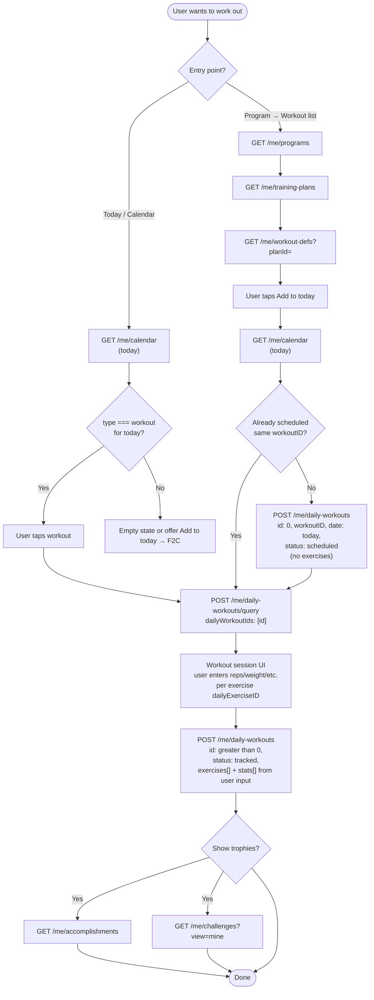
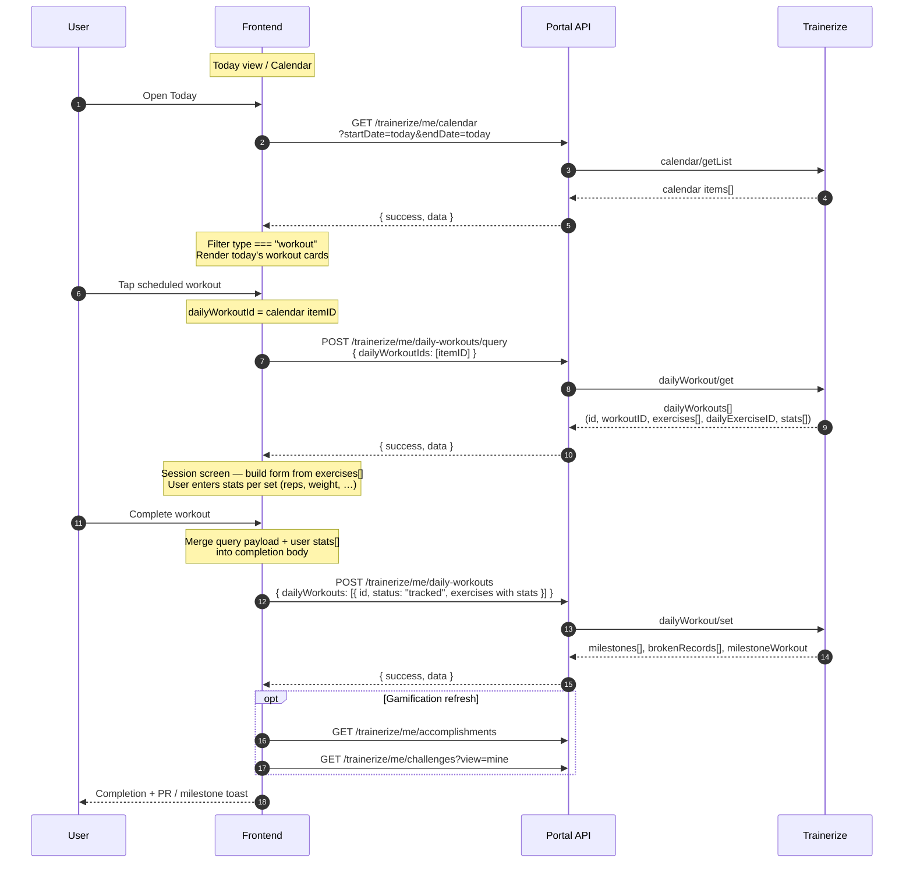
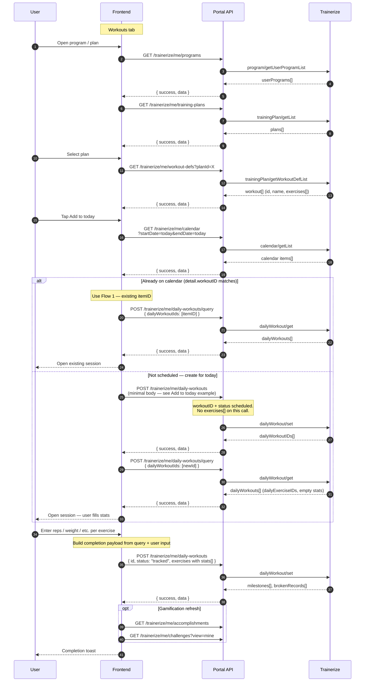

# Trainerize — Daily Workouts Flows (Frontend Reference)

> **Audience:** Frontend developers building Today view, calendar workout tap, and “Add to today” from a training plan.
> **Base path:** `/api` prefix (e.g. `GET /api/trainerize/me/calendar`).
> **Auth:** Session cookie `apex_access_token` on every request. Missing/invalid token → `401`.
> **Envelope:** `{ success: true, data: ... }` on success; `{ success: false, message: "..." }` on error.
>
> **Prerequisite:** User must have a Trainerize link (`GET /trainerize/me/link` → `data` not `null`).

Two supported paths to open and complete a workout. Both converge on **query session → user enters stats → save with `status: "tracked"`**.

**Related:** [`client-apis.md`](./client-apis.md) (request/response fields) · [`../../trainerize/workflows/workflow-daily-workouts-and-milestones.md`](../../trainerize/workflows/workflow-daily-workouts-and-milestones.md) · [`../../trainerize/client-workouts-flow.md`](../../trainerize/client-workouts-flow.md)

---

## Two POST phases — schedule vs complete

`POST /trainerize/me/daily-workouts` is used twice with **different payloads**:

| Phase | When | `id` | `status` | `exercises` / `stats` |
|-------|------|------|----------|-------------------------|
| **1 — Add to today** | Flow 2 only — schedule on calendar | `0` | `"scheduled"` | **Omit** — no sets/reps/weights yet |
| **2 — Complete workout** | Both flows — after session | `> 0` from query | `"tracked"` | **Required** — full `exercises[]` with user-entered `stats[]` |

**Add to today** only needs workout metadata + `workoutID`. Trainerize creates the daily instance and exercises when you query.

**Before completion**, hydrate the workout from `POST /me/daily-workouts/query`, let the user enter performance data in the UI, then merge that into each exercise’s `stats[]` (reps, weight, distance, time, etc. depending on `recordType`). **Every exercise stat must come from user input** — do not send empty or placeholder stats on complete.

---

## ID cheat sheet — do not mix these up

| ID | Source | Used for |
|----|--------|----------|
| **`itemID`** (calendar, `type === "workout"`) | `GET /me/calendar` | ✅ `dailyWorkoutId` — query & update session |
| **`workout[].id`** (workout definition) | `GET /me/workout-defs?planId=` | ✅ `workoutID` when **creating** today’s instance (`id: 0`) |
| **`dailyExerciseID`** | `POST /me/daily-workouts/query` | ✅ Per-exercise set logging on save |
| **`habits[].id`** / calendar `type === "habit"` **`itemID`** | Habits APIs | ❌ **Not** for workouts — see [`habits-daily-items-apis.md`](./habits-daily-items-apis.md) |

**Rule:** Workout defs show structure. **Daily workouts** are scheduled instances — open and save through daily-workout APIs.

---

## Simple flowchart (APIs)



### API quick map

| Step | Method | Route | When |
|------|--------|-------|------|
| Discover today’s schedule | `GET` | `/trainerize/me/calendar` | Flow 1; duplicate guard in Flow 2 |
| Browse plans / workouts | `GET` | `/trainerize/me/programs` | Flow 2 only |
| Browse plans / workouts | `GET` | `/trainerize/me/training-plans` | Flow 2 only |
| Browse plans / workouts | `GET` | `/trainerize/me/workout-defs?planId=` | Flow 2 only |
| Create today’s instance | `POST` | `/trainerize/me/daily-workouts` | Flow 2 only — minimal body, `id: 0`, `status: "scheduled"` |
| Load session | `POST` | `/trainerize/me/daily-workouts/query` | Both flows — get `dailyExerciseID`s for UI |
| Save / complete | `POST` | `/trainerize/me/daily-workouts` | Both flows — full `exercises[]` + user `stats[]`, `status: "tracked"` |
| Optional refresh | `GET` | `/trainerize/me/accomplishments` | After completion |
| Optional refresh | `GET` | `/trainerize/me/challenges?view=mine` | After completion |

**Do not send** Trainerize `userId` from the client — the portal injects it.

---

## Flow 1 — Calendar → open today’s scheduled workout

Use when the workout is **already on today’s calendar** (assigned by coach/program).

### When to use

- Today dashboard shows a workout card from calendar
- User taps a scheduled workout for today
- No “Add to today” step needed

### Sequence



### Minimal API example

**1. Calendar (today)**

```
GET /api/trainerize/me/calendar?startDate=2026-06-08&endDate=2026-06-08&unitDistance=km&unitWeight=kg
```

Find entry: `{ "type": "workout", "itemID": 12345, "detail": { "workoutID": 5001 } }`

**2. Query session**

```json
POST /api/trainerize/me/daily-workouts/query
{ "dailyWorkoutIds": [12345] }
```

**3. Complete** — send full workout with **user-entered** `stats[]` on every logged exercise:

```json
POST /api/trainerize/me/daily-workouts
{
  "unitWeight": "kg",
  "unitDistance": "km",
  "dailyWorkouts": [{
    "id": 12345,
    "name": "Upper Body Strength",
    "date": "2026-06-08",
    "type": "workoutRegular",
    "status": "tracked",
    "style": "normal",
    "exercises": [{
      "dailyExerciseID": 10282588,
      "def": { "id": 154, "name": "Bench Press" },
      "sets": 3,
      "recordType": "strength",
      "stats": [
        { "setID": 1, "reps": 10, "weight": 80 },
        { "setID": 2, "reps": 8, "weight": 85 },
        { "setID": 3, "reps": 6, "weight": 90 }
      ]
    }]
  }]
}
```

Each `stats[]` entry reflects what the user typed in the session UI (`reps`/`weight` for strength, `distance`/`time` for cardio, etc.).

---

## Flow 2 — Program → workout → Add to today

Use when the user picks a **workout definition** from a plan and it is **not** already scheduled today.

### When to use

- User browses program → training plan → workout list
- Taps **Add to today** on a workout def
- Calendar has no matching workout for today

### Sequence



### Add to today — request body (verified)

Use this **minimal** payload to schedule a workout on today’s calendar. **Do not** include `exercises` or `stats` — Trainerize materializes exercises on the next query.

```json
POST /api/trainerize/me/daily-workouts
{
  "unitWeight": "kg",
  "unitDistance": "km",
  "dailyWorkouts": [{
    "id": 0,
    "workoutID": 162125552,
    "name": "Upper Body Strength",
    "date": "2026-06-10",
    "type": "workoutRegular",
    "status": "scheduled",
    "style": "normal"
  }]
}
```

| Field | Source |
|-------|--------|
| `workoutID` | Workout def `id` from `GET /me/workout-defs?planId=` |
| `name` | Same workout’s display name |
| `date` | Today (`YYYY-MM-DD`) |
| `unitWeight` / `unitDistance` | From `GET /me/settings` (or user preference) |

**Response:** use `data.dailyWorkoutIDs[0]` as the new daily workout id.

### After add — query, then user input, then complete

**2. Query session** (get structure + `dailyExerciseID`s):

```json
POST /api/trainerize/me/daily-workouts/query
{ "dailyWorkoutIds": [<dailyWorkoutIDs[0]>] }
```

**3. Session UI** — for each exercise in the query response:

- Show targets from `def`, `sets`, `target`, `targetDetail`
- Collect **user input** per set → build `stats[]` (`setID`, `reps`, `weight`, …)
- Preserve each `dailyExerciseID` from the query — do not regenerate

**4. Complete** — same shape as Flow 1 step 3: full `dailyWorkouts[]` with `id > 0`, `status: "tracked"`, and **every logged exercise** includes the user’s `stats[]`.

---

## Save rules (both flows)

| Field | Rule |
|-------|------|
| `id` | `0` = create (Add to today only); `> 0` = update existing instance (complete) |
| `workoutID` | Required on **Add to today** (`id: 0`) — workout def id |
| `exercises` | **Omit** on Add to today; **required** on complete with user-filled `stats[]` |
| `dailyExerciseID` | From query response — preserve on complete; use `0` only for new mid-session exercises |
| `stats[]` | **User input only** — one entry per logged set; fields depend on `recordType` |
| `status` | `"scheduled"` on Add to today → optional `"checkedIn"` → **`"tracked"`** on complete |
| `comments` / `rpe` | Only on **first** completion |

### Building `stats[]` from user input

| `recordType` | Typical user fields → `stats[]` |
|--------------|----------------------------------|
| `strength` | `reps`, `weight` |
| `endurance` | `reps` |
| `cardio` | `distance`, `time`, `calories` |
| `timedFasterBetter` / `timedLongerBetter` | `time` |

Start from the query response’s exercise list; overlay what the user entered before POSTing complete.

### Status progression

| Status | Meaning |
|--------|---------|
| `scheduled` | On calendar, not started |
| `checkedIn` | Started, not finished (optional) |
| `tracked` | Completed — triggers milestones, PRs, challenge points |

---

## Completion response (show immediately)

`POST /me/daily-workouts` with `status: "tracked"` may return:

| Field | Use in UI |
|-------|-----------|
| `milestoneWorkout` | Nth workout milestone (`> 0`) |
| `milestones[]` | Cumulative exercise thresholds (time/distance) |
| `brokenRecords[]` | Personal bests — celebrate in-session |
| `dailyWorkoutIDs[]` | Confirms IDs after create/update |

Use `GET /me/accomplishments` for history / trophy case.

---

## Known constraints

| Issue | Workaround |
|-------|------------|
| No `dailyWorkout/getList` | Calendar → `itemID` → query |
| Custom `exercises[]` without `workoutID` on create | Use `workoutID` on Add to today (minimal body above) |
| Duplicate “Add to today” | Check calendar first; open existing `itemID` if found |

See [`../../trainerize/api-reference/trainerize-api-issues.md`](../../trainerize/api-reference/trainerize-api-issues.md).

---

## Test checklist

- [ ] Today calendar shows workouts where `type === "workout"`
- [ ] Flow 1: tap calendar item → query → complete with same `id`
- [ ] Flow 2: Add to today uses minimal body (no `exercises`); response includes `dailyWorkoutIDs`
- [ ] After query, completion sends user-entered `stats[]` on every logged exercise
- [ ] Flow 2: duplicate guard redirects to existing calendar `itemID`
- [ ] `dailyExerciseID` preserved on save; stats persist on re-query
- [ ] Completion returns `brokenRecords` / `milestones` when applicable
- [ ] Accomplishments feed updates after completion
